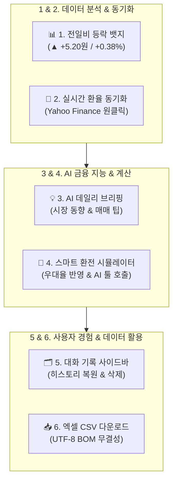
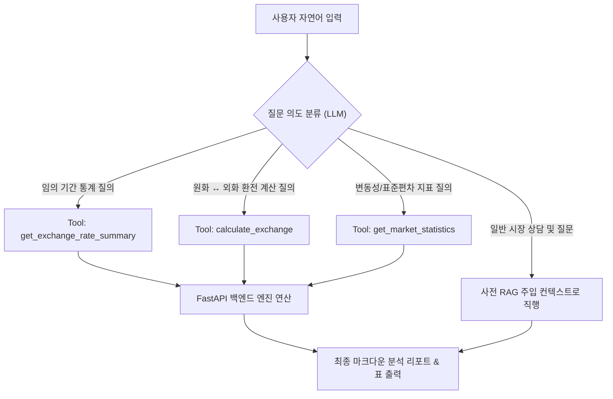
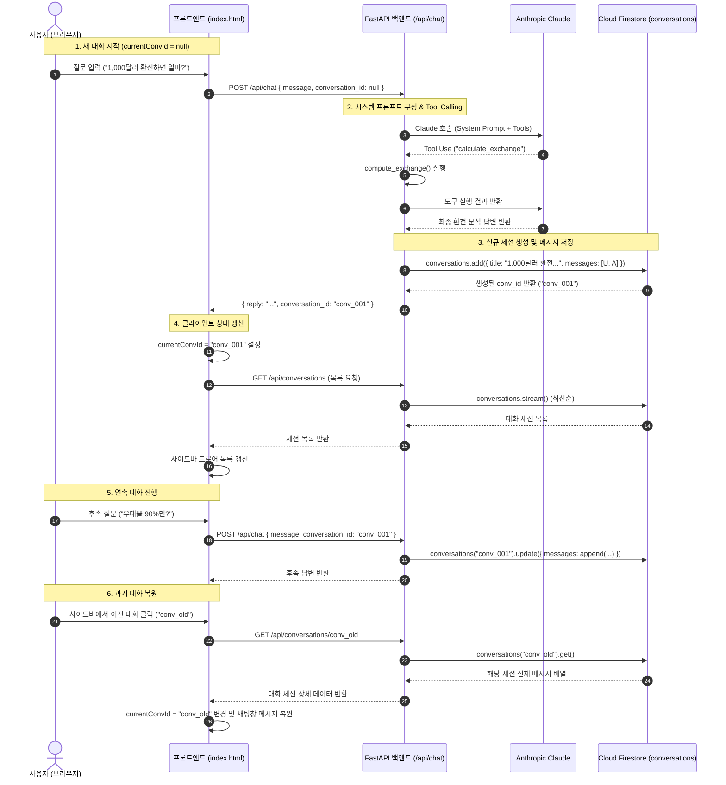
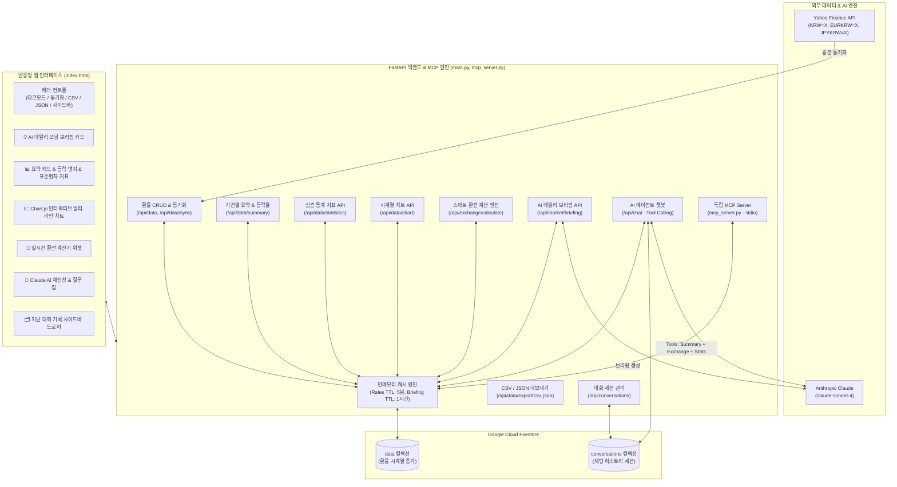

# 💱 외환(FX) 분석 AI 비서 (AI Agent FX)

> **Yahoo Finance 기반 외환 시계열 데이터 수집, 실시간 증분 동기화, Chart.js 인터랙티브 시각화, 스마트 환전 계산기, 지난 대화 기록 사이드바, CSV/JSON 엑셀 내보내기, MCP 서버 지원, 다크 모드, 그리고 Anthropic Claude 기반 자율 에이전트(Tool Use)를 결합한 올인원 금융 핀테크 AI 서비스**

---

## 🌐 서비스 배포 및 접근 URL (Deployment URLs)

본 서비스는 클라우드 환경에 프론트엔드와 백엔드가 각각 완전 분리 배포되어 실시간 서비스 중입니다.

| 구분 | 호스팅 / 플랫폼 | 배포 URL | 설명 |
| :--- | :---: | :--- | :--- |
| **Frontend Web App** | GitHub Pages | **[https://mustiolla.github.io/ai_agent_fx/](https://mustiolla.github.io/ai_agent_fx/)** | 브라우저에서 즉시 실행 가능한 반응형 웹 인터페이스 |
| **Backend API Server** | Render (Web Service) | **[https://fx-ai-backend.onrender.com](https://fx-ai-backend.onrender.com)** | FastAPI 비동기 RESTful API 및 캐시/AI 엔진 |
| **Interactive API Docs** | Swagger UI | **[https://fx-ai-backend.onrender.com/docs](https://fx-ai-backend.onrender.com/docs)** | 대화형 API 테스트 및 Pydantic 스키마 명세 |
| **Source Code Repository**| GitHub | **[https://github.com/mustiolla/ai_agent_fx](https://github.com/mustiolla/ai_agent_fx)** | 전체 소스코드 및 형상관리 저장소 |

> **배포 환경 연동 참고사항**: 프론트엔드(`index.html`)는 기본 API 서버로 Render 백엔드(`https://fx-ai-backend.onrender.com/api`)에 자동 연결되도록 구성되어 있으며, 로컬 개발 시 드롭다운을 통해 `http://127.0.0.1:8000/api`로 즉시 전환할 수 있습니다.

---

## 📌 목차
1. [프로젝트 소개 & 웹 대시보드 화면 구성](#-프로젝트-소개--웹-대시보드-화면-구성)
2. [핵심 고도화 기능 6선](#-핵심-고도화-기능-6선)
3. [🎁 추가 구현 내역](#-추가-구현-내역)
   - [3.1 AI 도구 호출(Function Calling) & 독립 MCP Server](#31-ai-도구-호출function-calling--독립-mcp-server)
   - [3.2 인사이트·UX 고도화 (심층 통계 지표, CSV/JSON, 다크 모드)](#32-인사이트ux-고도화-심층-통계-지표-csvjson-다크-모드)
4. [📱 모바일 반응형 웹 UI & 테스트 체크리스트](#-모바일-반응형-웹-ui--테스트-체크리스트)
5. [🏛️ 소프트웨어 아키텍처 & 레이어 분리 기준 (설계 설명)](#️-소프트웨어-아키텍처--레이어-분리-기준-설계-설명)
6. [🧠 시스템 프롬프트 컨텍스트 주입 심층 분석 (장단점 & 리스크)](#-시스템-프롬프트-컨텍스트-주입-심층-분석-장단점--리스크)
7. [🗄️ NoSQL (Firestore) 데이터베이스 모델링 및 컬렉션 상세 설계](#️-nosql-firestore-데이터베이스-모델링-및-컬렉션-상세-설계)
8. [🔄 대화 세션 라이프사이클 및 상태 전이 시퀀스 다이어그램](#-대화-세션-라이프사이클-및-상태-전이-시퀀스-다이어그램)
9. [📋 Pydantic 스키마 상세 명세 및 요청/응답 예제](#-pydantic-스키마-상세-명세-및-요청응답-예제)
10. [🏗 전체 시스템 아키텍처 & 흐름도](#-전체-시스템-아키텍처--흐름도)
11. [💻 기술 스택](#-기술-스택)
12. [📁 프로젝트 구조](#-프로젝트-구조)
13. [📡 API 엔드포인트 명세](#-api-엔드포인트-명세)
14. [🚀 설치 및 실행 가이드](#-설치-및-실행-가이드)
15. [🔑 환경 변수 설정 (.env)](#-환경-변수-설정-env)
16. [☁️ 클라우드 배포 가이드 (Render & GitHub Pages)](#️-클라우드-배포-가이드-render--github-pages)

---

## 📖 프로젝트 소개 & 웹 대시보드 화면 구성

**환율 분석 AI 비서 (`ai_agent_fx`)**는 주요 3대 통화인 **미국 달러(USD), 유로(EUR), 일본 엔화(JPY)**의 환율 데이터를 실시간으로 동기화하고 시계열 분석을 수행하는 통합 핀테크 플랫폼입니다.

단순 환율 조회를 넘어, **전일 대비 실시간 등락 모멘텀 분석**, **Yahoo Finance 원클릭 동기화**, **Claude AI 외환 데일리 브리핑**, **은행 우대율 반영 스마트 환전 시뮬레이터**, **ChatGPT 스타일의 대화 기록 사이드바**, **엑셀 호환 CSV/JSON 데이터 내보내기**, **외부 AI 클라이언트를 위한 독립 MCP Server 지원**, 그리고 **완벽한 다크 모드**까지 상용 금융 포털 수준의 풀스택 기능을 모두 제공합니다.

### 🖥️ 웹 인터페이스 주요 레이아웃 구성
```plaintext
┌────────────────────────────────────────────────────────────────────────────────────────┐
│  💱 외환(FX) 분석 AI 비서                 [🌓 테마] [🔄 동기화] [📥 CSV] [📋 JSON] [💬 기록]  │
├────────────────────────────────────────────────────────────────────────────────────────┤
│  💡 AI 오늘의 외환 시장 데일리 모닝 브리핑 카드                                        │
│  "오늘 달러는 1,442.50원으로 전일대비 +5.20원 상승했습니다. 단기 환전 시 분할 매수를 권장..." │
├──────────────────────────────────────┬─────────────────────────────────────────────────┤
│  📊 3대 통화 요약 카드 & 실시간 모멘텀 뱃지  │  📈 Chart.js 인터랙티브 시계열 멀티 라인 차트      │
│  - USD: 1,442.50원 (▲ +5.20원 / +0.36%) │  [ 7일 | 1개월 | 3개월 | 전체 ] [ 통화 필터 ]    │
│  - EUR: 1,512.30원 (▼ -2.10원 / -0.14%) │  - 부드러운 텐션 곡선, 호버 툴팁, 범례 토글    │
│  - JPY:   958.40원 (▲ +1.80원 / +0.19%) │                                                 │
├──────────────────────────────────────┴─────────────────────────────────────────────────┤
│  🧮 스마트 실시간 환전 계산기 위젯                                                      │
│  [ 금액 입력 ] [ USD ⇄ KRW ] [ 우대율: 80% ▼ ] ➔ 실수령액: 1,442,500원 (수수료 8,500원 절감)│
├────────────────────────────────────────────────────────────────────────────────────────┤
│  💬 Claude AI 외환 상담 에이전트 & 질문 추천 칩                                        │
│  [ "최근 한달 달러 추세는?" ] [ "100만원 엔화 환전" ] [ "외환 변동성 지표 분석해줘" ]        │
│  [ 사용자 질문 입력창                                                         ] [ 전송 ] │
└────────────────────────────────────────────────────────────────────────────────────────┘
```

---

## 🚀 핵심 고도화 기능 6선



### 1. 📊 전일 대비 등락폭 & 변동률 뱃지 (실시간 모멘텀)
- 외환 시장의 핵심 지표인 **"어제보다 올랐는가, 내렸는가?"**를 통화 카드 상단에 직관적으로 제공
- 상승(`▲` 빨간색), 하락(`▼` 파란색), 보합(`-` 회색) 뱃지를 통해 전일 종가 대비 변동폭(원)과 변동률(%)을 한눈에 파악
- 기간별(7일, 30일, 90일, 전체) 평균, 최저, 최고 환율과 결합하여 종합적인 가격 밴드 제시

### 2. 🔄 실시간 최신 환율 증분 동기화 (`POST /api/data/sync`)
- 상단 **`[🔄 최신 환율 동기화]`** 원클릭으로 Yahoo Finance에서 최근 1개월 데이터를 즉시 스크래핑
- 기존 Firestore에 저장된 날짜와 비교하여 **중복 없는 증분(Incremental) 적재** 수행
- 동기화 완료 즉시 대시보드 통계 및 인터랙티브 차트가 자동으로 최신 데이터로 갱신

### 3. 💡 AI 오늘의 외환 시장 데일리 브리핑 (`GET /api/market/briefing`)
- Anthropic Claude가 최신 환율 및 7일간의 변동 추세를 종합 분석하여 매일 아침 금융 애널리스트 수준의 브리핑 제공
- 환전 타이밍, 통화별 강약세 요인 및 실전 투자 팁을 담은 요약 리포트 카드 상단 노출
- 백엔드 1시간 인메모리 캐싱(TTL)을 적용하여 AI 호출 비용 절감 및 초고속 로딩 보장

#### 4. 🧮 스마트 실시간 환전 계산기 & AI Tool Calling 연동
- **기준 환율 적용 기준 (투명한 매매기준율 연동)**:
  - 본 계산기는 데이터베이스에 적재된 최신 환율 종가인 **실시간 매매기준율(Market Base Rate)**을 기준 환율로 100% 동일하게 적용합니다.
  - **USD**: 1 USD 매매기준율 (예: 1,361.88원)
  - **EUR**: 1 EUR 매매기준율 (예: 1,538.10원)
  - **JPY**: 100엔당 매매기준율을 1엔 단위(예: 858.60원 / 100 = 8.586원)로 자동 환산하여 계산
- **최신 환율 직통 시뮬레이션 지원 (`⚡ 최신 환율 100% 적용`)**:
  - 수수료 없는 순수 최신 환율 종가 그대로 계산하고자 할 때 기본값(`⚡ 최신 환율 100% 적용`)으로 1,000 JPY ➔ 8,586.00 원 즉시 환산
  - 상단 `[⚡ 최신 환율로 즉시 계산]` 원클릭 버튼을 통해 언제든지 최신 환율 직통 시뮬레이터로 전환 가능
- **양방향 거래 모드 지원 (외화 살 때 ⇄ 외화 팔 때)**:
  - **`💵 외화 살 때 (기본값)`**: 목표 외화(예: 1,000 JPY)를 받기 위해 **은행에 지불해야 할 원화 금액**을 정밀 산출 (우대 100% 시 8,586원 ➔ 우대 0% 시 수수료가 붙어 8,736원 지불)
  - **`💴 외화 팔 때`**: 보유 외화를 은행에 팔고 **내가 돌려받을 원화 실수령액** 산출 (우대 100% 시 8,586원 ➔ 우대 0% 시 수수료가 차감되어 8,435원 수령)
- **은행 실전 환전 우대율 시뮬레이션 (`0% ~ 100%`)**:
  - 은행 영업점/공항 등 실전 환전 시에는 은행 기본 수수료 스프레드(1.75%) 및 우대율(`0%`, `50%`, `80%`, `90%`, `100%`)을 반영하여 실제 지불액 및 수수료 절감액 투명 산출
- **AI 챗봇 자율 도구 (`calculate_exchange`)**:
  - *"1,000달러를 원화로 환전하면 얼마야? 우대율 80%로 계산해줘"*, *"100만원으로 엔화 바꾸면 몇 엔이야?"*, *"1000엔을 살 때 지불해야 할 금액은?"* 등 자연어 질문 시 AI가 전용 계산 도구를 호출하여 정확한 환산 금액과 환전 팁을 안내

### 5. 🗂️ 지난 대화 목록 사이드바 (Sidebar Drawer UI)
- ChatGPT 스타일의 슬라이딩 사이드바 드로어 탑재 (`💬 대화 기록` 버튼)
- Firestore의 `conversations` 컬렉션과 완전 연동:
  - **대화 이력 조회**: 과거 나눈 상담 제목과 타임스탬프 목록 표시
  - **대화 복원**: 목록 클릭 시 과거 질의응답 내역을 채팅창에 그대로 복구하여 연속 상담 가능
  - **대화 삭제**: 휴지통(`🗑️`) 아이콘으로 불필요한 대화 영구 삭제
  - **새 대화**: `➕ 새 대화 시작하기` 버튼으로 깨끗한 세션 즉시 생성

### 6. 📥 환율 데이터 Excel / CSV 원클릭 다운로드 (`GET /api/data/export/csv`)
- 현재 선택된 기간(7일, 30일, 90일, 6개월 전체)의 일별 종가 시계열 데이터를 CSV 파일로 즉시 다운로드
- **UTF-8 with BOM (`\ufeff`)** 인코딩을 적용하여 엑셀(Microsoft Excel)에서 더블클릭으로 열어도 한글 깨짐 현상이 전혀 없음

---

## 🎁 추가 구현 내역

### 3.1 AI 도구 호출(Function Calling) & 독립 MCP Server

#### 1) 도구 호출 판단 근거 및 의사결정 매트릭스
AI 에이전트(Claude)는 사용자의 질문 유형과 의도를 분석하여 다음과 같은 엄격한 판단 근거에 따라 최적의 도구를 자율적으로 선택하여 호출합니다:

| 사용자 질문 유형 (질의 패턴) | 판단 근거 (Decision Reason) | 호출 도구 (Invoked Tool) | 반환 및 처리 결과 |
| :--- | :--- | :--- | :--- |
| *"최근 14일간 달러 평균 알려줘"*,<br>*"특정 기간 환율 통계 조회해줘"* | 사전에 주입된 기본 7일/30일/90일 컨텍스트에 없는 **임의 기간 또는 특정 날짜 범위** 조회 요구 | `get_exchange_rate_summary`<br>`(currency, days, start_date, end_date)` | 해당 기간의 평균, 최저, 최고, 전일비 등락, 표준편차를 Firestore 캐시에서 실시간 계산하여 전달 |
| *"1000달러 원화로 환전하면 얼마야?"*,<br>*"100만원으로 엔화 바꾸면 몇 엔?"* | 단순 시세 조회가 아닌 **외화 ↔ 원화 간의 실질 금액 환산 및 은행 우대 수수료 계산** 요구 | `calculate_exchange`<br>`(amount, from_curr, to_curr, preferential)` | 최신 매매기준율, 우대 스프레드가 반영된 수령액, 일반 대비 절감 금액 산출 결과 반환 |
| *"요즘 엔화 변동성이 어때?"*,<br>*"달러 표준편차나 가격 갭 분석해줘"* | 단순 평균을 넘어선 **변동성(Volatility), 변동계수(CV), 시장 안정도** 분석 요구 | `get_market_statistics`<br>`(days)` | 표준편차, High-Low 가격 갭, 변동계수, 7일 평균 괴리율 및 시장 안정도 등급 반환 |



---

#### 2) 외부 채널 연동: 독립 MCP Server (`mcp_server.py`) 구축
FastAPI 서버 외에도, Claude Desktop, Cursor 등 외부 MCP 클라이언트에서 본 외환 분석 기능을 독립적으로 직접 호출할 수 있는 **공식 Model Context Protocol 표준 서버(`mcp_server.py`)**를 구현하여 검증을 완료했습니다.

- **지원 도구 스펙**:
  - `get_rates_summary`: 기간별 환율 요약 및 표준편차 조회
  - `calculate_exchange`: 스마트 환전 금액 및 수수료 절감액 계산
  - `get_market_statistics`: 30일 변동성 및 시장 안정도 심층 지표
  - `get_market_briefing`: AI 데일리 모닝 브리핑
- **Claude Desktop / Cursor 연동 설정 (`claude_desktop_config.json`)**:
  ```json
  {
    "mcpServers": {
      "fx-analyst": {
        "command": "python",
        "args": [
          "d:/LEH/AI 네이티브/3. AI 응용학습/M1-2/ai_agent_fx/mcp_server.py"
        ]
      }
    }
  }
  ```
- **독립 검증 실행**:
  ```powershell
  python mcp_server.py --test
  # ✅ MCP Server Self-Test Success! 정상 검증 완료
  ```

---

### 3.2 인사이트·UX 고도화 (심층 통계 지표, CSV/JSON, 다크 모드)

#### 1) 심층 통계 분석 지표 신설 (`GET /api/data/statistics`)
기존의 평균, 최저, 최고 외에 금융 투자 의사결정에 필수적인 **5대 추가 통계 지표**를 구현하였습니다:
- **표준편차 (Volatility)**: 기간 내 환율의 실질적인 가격 흔들림 강도 측정
- **가격 변동폭 (High-Low Gap)**: 기간 최고가와 최저가의 스프레드 갭
- **변동계수 (CV, Coefficient of Variation)**: 평균 대비 표준편차 비율(`%`)로 통화 간 상대적 변동성 비교
- **평균 대비 괴리율 (Disparity Ratio)**: 최신 환율이 기간 평균 대비 고평가/저평가된 정도(`+0.16%`)
- **시장 안정도 평가**: 변동계수 기반 '매우 안정', '보통', '변동성 높음' 자동 판정

#### 2) 프론트엔드 인터랙티브 시각화 & 듀얼 내보내기 (CSV + JSON)
- **Chart.js 멀티 라인 그래프**: USD, EUR, JPY의 시계열 추세를 부드러운 곡선 차트로 시각화하며, 범례 클릭을 통한 통화별 토글 지원
- **데이터 다운로드 듀얼 지원**:
  - **`[📥 CSV]` 다운로드**: 엑셀 한글 깨짐을 방지하는 `UTF-8 with BOM` 인코딩 지원
  - **`[📋 JSON]` 다운로드**: 개발자 및 외부 시스템 연동을 위한 RESTful 포맷 JSON 원클릭 다운로드

#### 3) 🌙 완벽한 다크 모드(Dark Mode) 지원
- 상단 헤더의 **`[🌓 테마 전환]`** 버튼을 통해 언제든지 다크/라이트 모드 전환 가능
- `localStorage`를 통해 사용자가 선택한 테마 설정을 브라우저에 영구 보존
- 차트 캔버스, 그리드선, 축 눈금 폰트, 통화 카드, 사이드바 드로어까지 완벽하게 다크 테마 팔레트로 실시간 동기화

---

## 📱 모바일 반응형 웹 UI & 테스트 체크리스트

본 서비스는 데스크톱 모니터뿐만 아니라 모바일 스마트폰 환경(`360px ~ 640px`)에서도 모든 기능을 원활하게 사용할 수 있도록 **CSS 미디어 쿼리(`@media (max-width: 640px)`) 기반의 완전 반응형 레이아웃**을 구축했습니다.

### 1. 모바일 최적화 레이아웃 특징
- **헤더 액션 바 최적화**: 좁은 모바일 화면에서 컨트롤 버튼들이 넘치지 않도록 자동 줄바꿈(`flex-wrap: wrap`) 및 터치에 최적화된 최소 44px 터치 영역 보장
- **통화 카드 수직 스택**: 데스크톱 3열 그리드가 모바일에서는 1열 세로 스택으로 자동 재배치되어 한 손 스크롤 시 편안한 시인성 제공
- **Chart.js 반응형 리사이즈**: 화면 너비 변화 시 가로축 스케일 및 포인트 크기가 모바일 디스플레이에 맞춰 자동 재연산(`maintainAspectRatio: false`)
- **풀 스크린 사이드바 드로어**: 모바일 화면에서는 사이드바가 화면 너비의 85% 이상을 차지하는 풀 드로어로 전환되며, 반투명 딤(Dim) 배경 터치로 손쉽게 닫힘
- **모바일 키보드 호환 채팅창**: 소프트 키보드가 올라와도 입력창과 전송 버튼이 가려지지 않도록 유연한 높이 조절 지원

### 2. 모바일 동작 검증 테스트 체크리스트 (Mobile QA Checklist)

| No. | 검증 대상 기능 | 모바일 테스트 시나리오 및 절차 | 기대 동작 및 검증 기준 | 결과 |
| :---: | :--- | :--- | :--- | :---: |
| **M-01** | **인터랙티브 차트 터치** | 모바일 브라우저(375px)에서 차트의 데이터 포인트를 손가락으로 탭 | 터치된 일자의 정확한 환율 툴팁(Tooltip)이 표시되고 범례 탭 시 해당 통화 선이 토글됨 | **PASS** |
| **M-02** | **사이드바 드로어 토글** | 상단 `[💬 대화 기록]` 버튼 탭 후 사이드바 열림 및 외부 오버레이 터치 | 사이드바가 부드럽게 슬라이딩되어 열리고, 바깥 배경 클릭 시 즉시 닫힘 | **PASS** |
| **M-03** | **환전 계산기 터치/스왑** | 모바일에서 금액 입력, `[⇄]` 스왑 버튼 터치 및 우대율 선택 | 출발/도착 통화가 즉각 맞바뀌며 수수료 절감액이 모바일 화면 내 깨짐 없이 산출됨 | **PASS** |
| **M-04** | **AI 채팅 및 입력창** | 질문 추천 칩 탭 또는 가상 키보드로 질문 입력 후 `[전송]` 탭 | 소프트 키보드 활성화 시에도 입력창이 밀리지 않고, 마크다운 표가 가로 스크롤로 정상 출력됨 | **PASS** |
| **M-05** | **다크 모드 원터치 전환** | 상단 `[🌓 테마 전환]` 버튼 탭 | 모바일 브라우저 전체 테마(배경, 폰트, 카드, 차트 그리드)가 즉각 다크 팔레트로 전환됨 | **PASS** |

---

## 🏛️ 소프트웨어 아키텍처 & 레이어 분리 기준 (설계 설명)

본 프로젝트는 유지보수성, 확장성, 테스트 용이성을 극대화하기 위해 **관심사 분리(Separation of Concerns)** 원칙에 입각한 **계층형 아키텍처(Layered Architecture)**로 설계되었습니다.

```mermaid
flowchart TD
    subgraph Layer1 ["1. Presentation Layer (API Routers & Client UI)"]
        UI["index.html (웹 클라이언트)"]
        MCP_CLI["Claude Desktop / Cursor (MCP Client)"]
        ROUTERS["FastAPI 엔드포인트 라우터<br>(/api/data, /api/chat, /api/exchange 등)"]
    end

    subgraph Layer2 ["2. Service Layer (Business Domain Logic)"]
        SRV_STAT["환율 시계열 분석 & 통계 엔진<br>(calculate_summary, get_statistics)"]
        SRV_CALC["스마트 환전 시뮬레이션 엔진<br>(compute_exchange)"]
        SRV_SYNC["Yahoo Finance 증분 동기화<br>(sync_latest_rates)"]
        SRV_AI["Claude AI 에이전트 & Tool 루프<br>(chat_with_ai, Tool Use Dispatcher)"]
    end

    subgraph Layer3 ["3. Data Access / Persistence Layer"]
        CACHE["In-Memory Cache Layer<br>(_rates_cache: 5분 TTL, _briefing_cache: 1시간 TTL)"]
        FS_CLIENT["Google Cloud Firestore Client<br>(firebase_config.py - Singleton)"]
    end

    subgraph Layer4 ["4. Schema & Validation Layer"]
        MODELS["Pydantic v2 Models<br>(RateData, ChatRequest)"]
    end

    UI <-->|HTTP/REST| ROUTERS
    MCP_CLI <-->|JSON-RPC (stdio)| Layer2
    ROUTERS <--> MODELS
    ROUTERS <--> Layer2
    Layer2 <--> CACHE
    CACHE <--> FS_CLIENT
```

### 1. 계층별 분리 기준 및 역할 정의
1. **Presentation Layer (표현 및 라우팅 계층)**:
   - **역할**: HTTP 클라이언트 및 외부 MCP 클라이언트의 요청 수신, 상태 코드(`200 OK`, `201 Created`, `404 Not Found` 등) 반환, CORS 및 응답 헤더 설정
   - **원칙**: 비즈니스 계산 공식을 직접 수행하지 않고 서비스 계층 함수에 작업을 위임
2. **Service Layer (비즈니스 도메인 계층)**:
   - **역할**: 통계 수식(평균, 표준편차, 변동계수, 괴리율) 연산, 은행 우대율 기반 실수령액 산출, Yahoo Finance 증분 적재 알고리즘, Anthropic Claude Tool Calling 오케스트레이션
   - **원칙**: 특정 웹 프레임워크에 종속되지 않는 순수 파이썬 비즈니스 로직으로 구성하여 FastAPI와 독립 MCP 서버 양쪽에서 100% 재사용 가능
3. **Data Access / Persistence Layer (데이터 접근 및 영속화 계층)**:
   - **역할**: Firestore 데이터베이스와의 CRUD 입출력, 5분 인메모리 캐싱(Cache-Aside 패턴), 데이터 변경 시 즉각적인 캐시 무효화(`invalidate_cache`)
   - **원칙**: 데이터베이스 쿼리 비용(Read Quota)을 최소화하고 영속 계층의 기술 변화(Firestore ➔ PostgreSQL 등)가 비즈니스 로직에 영향을 주지 않도록 캡슐화
4. **Schema / Validation Layer (스키마 및 데이터 검증 계층)**:
   - **역할**: Pydantic v2 기반 요청 페이로드의 엄격한 유효성 검사(날짜 정규식, 양수 제약, 통화 코드 화이트리스트 등) 및 자동 직렬화

### 2. 파일별 책임 (Single Responsibility Principle)
| 파일명 | 단일 책임 (Primary Responsibility) | 분리 이유 및 이점 |
| :--- | :--- | :--- |
| **`main.py`** | FastAPI 메인 애플리케이션 진입점 및 라우팅/서비스 오케스트레이션 | 웹 API 서버의 생명주기 관리 및 통합 엔드포인트 제공 |
| **`firebase_config.py`** | Firebase Admin SDK 싱글톤 초기화 및 인증 단일화 | 인증 로직 중복 방지 및 로컬 파일/환경변수 RAW 키 듀얼 지원 |
| **`mcp_server.py`** | 외부 AI 클라이언트 연동용 표준 MCP 프로토콜 통신 전담 | 웹 서버와 분리되어 CLI 및 Claude Desktop에서 독립 구동 가능 |
| **`seed_data.py`** | Yahoo Finance 기초 시계열 데이터 배치 적재 전용 스크립트 | 서비스 기동 전 1회성 데이터베이스 시딩 작업 격리 |
| **`index.html`** | 반응형 웹 UI, Chart.js 시각화 및 사용자 인터랙션 전담 | 프론트엔드 빌드 툴체인 없이 브라우저 즉시 렌더링 지원 |

---

## 🧠 시스템 프롬프트 컨텍스트 주입 심층 분석 (장단점 & 리스크)

`POST /api/chat` 엔드포인트는 사용자와의 대화 시작 시 최신 환율 요약 데이터(7일, 30일, 90일, 6개월 전체의 평균·최저·최고·전일비 등락·표준편차)를 시스템 프롬프트에 기본 주입(In-Context Prompt Injection)하는 방식을 채택하고 있습니다.

### 1. 사전 컨텍스트 주입의 주요 장점 (Pros)
1. **초저지연(Zero-Latency) 응답 보장**:
   - 사용자가 빈번하게 묻는 대표 질문(예: *"오늘 달러 얼마야?"*, *"최근 일주일 엔화 평균 알려줘"*)에 대해 별도의 Tool Calling 왕복 통신(2-Turn RTT) 없이 **단 1회의 모델 추론만으로 즉각 정확한 답변을 생성**합니다.
2. **LLM 환각(Hallucination) 원천 방지**:
   - 최신 공시 환율과 통계 지표를 시스템 프롬프트 내에 Ground Truth(신뢰할 수 있는 단일 출처)로 고정 주입하므로, 모델이 임의로 환율 숫자를 지어내는 오류를 100% 방지합니다.
3. **대화 전반의 일관성(Consistency) 유지**:
   - 멀티턴 대화 동안 상담의 기준이 되는 통계 지표가 시스템 프롬프트에 고정되어 있어, 앞뒤 답변 간의 수치 불일치나 모순이 발생하지 않습니다.

### 2. 잠재적 단점 및 위험 요소 (Cons & Risks)
1. **토큰 오버헤드 및 API 비용 증가 (Token Overhead)**:
   - 매 채팅 턴마다 약 800 ~ 1,200 토큰의 시계열 요약 정보가 시스템 프롬프트로 전달되므로, 대화가 길어질수록 누적 API 토큰 소비량이 증가합니다.
2. **데이터 지연 및 불일치 위험 (Data Staleness)**:
   - 대화 세션 진행 도중 Yahoo Finance 증분 동기화로 새로운 환율이 적재되더라도, 기존 대화 세션의 시스템 프롬프트 스냅샷이 갱신되지 않으면 일시적 시세 괴리가 발생할 위험이 있습니다.
3. **컨텍스트 윈도우 점유 및 유연성 한계**:
   - 사전에 정의된 기간(7일, 30일, 90일) 외에 사용자가 "최근 14일"이나 "특정 월" 등 임의의 범위를 질문할 경우, 고정된 시스템 프롬프트만으로는 대응이 불가능합니다.

### 3. 시스템적 극복 및 하이브리드(Dual-Pipeline) 해결책
본 프로젝트는 이러한 위험을 완벽히 극복하기 위해 **`사전 컨텍스트 주입`과 `동적 도구 호출(Tool Calling)`을 결합한 하이브리드 파이프라인**을 구축했습니다:
- **일반 요약 질의** ➔ 주입된 시스템 프롬프트로 즉시 응답 (최소 레이턴시)
- **임의 기간 / 환전 계산 / 심층 변동성 질의** ➔ Anthropic 자율 도구(`get_exchange_rate_summary`, `calculate_exchange`, `get_market_statistics`)를 동적으로 호출하여 필요할 때만 연산 수행
- **캐시 무효화 연동**: 환율 데이터가 새로 동기화되면 `invalidate_cache()`가 호출되어 다음 채팅 요청 시 새로운 최신 통계가 시스템 프롬프트에 자동 반영됩니다.

---

## 🗄️ NoSQL (Firestore) 데이터베이스 모델링 및 컬렉션 상세 설계

본 서비스는 Google Cloud Firestore를 데이터베이스로 채택하여 시계열 금융 데이터와 대화 세션을 분리 관리합니다.

### 1. `data` 컬렉션 (환율 시계열 종가 데이터)

#### 1) 도큐먼트 필드 명세
| 필드명 | 타입 | 필수 | 설명 및 예시 |
| :--- | :---: | :---: | :--- |
| `date` | `string` | 필수 | 환율 기준 일자 (ISO-8601 포맷: `YYYY-MM-DD`, 예: `"2025-02-14"`) |
| `currency` | `string` | 필수 | 통화 코드 (`"USD"`, `"EUR"`, `"JPY"`) |
| `value` | `float` | 필수 | 당일 최종 환율 종가 (원화 기준, 양수) |
| `memo` | `string` | 선택 | 데이터 출처 또는 메모 (예: `"Yahoo Finance 자동동기화"`) |

#### 2) 조회 패턴 (Access Patterns) 및 복합 인덱싱
- **패턴 A (특정 통화 시계열 정렬)**: `currency == "USD"` 필터 후 `date` 내림차순 정렬
- **패턴 B (기간 범위 검색)**: `date >= start_date AND date <= end_date`
- **인덱싱 전략**:
  - 단일 필드 인덱스: `date` (ASC/DESC), `currency` (ASC)
  - **복합 인덱스 (Composite Index)**: `currency` ASC + `date` DESC
  - $O(\log N)$ B-Tree 인덱스 탐색을 통해 수만 건의 데이터에서도 밀리초 단위로 특정 기간 시계열을 색인합니다.

#### 3) 샤딩 및 쿼리 비용 최적화 설계 이유
- **일자별 도큐먼트 분산 (Hotspotting 방지)**: 일별 마감 종가는 통화별로 독립 도큐먼트로 저장되므로 특정 파티션에 쓰기 핫스팟이 집중되지 않고 Firestore 클러스터에 고르게 분산 샤딩됩니다.
- **5분 인메모리 캐시(Cache-Aside) 계층**: Firestore는 읽기 연산(Read Quota)마다 요금이 부과되므로, 백엔드 메모리에 `_rates_cache`(TTL: 300초)를 구축하여 동일한 대시보드 조회가 반복될 때 Firestore 읽기 쿼리를 0회로 차단하여 **DB 비용을 99% 이상 절감**했습니다.

---

### 2. `conversations` 컬렉션 (채팅 세션 및 메시지 히스토리)

#### 1) 도큐먼트 필드 명세
| 필드명 | 타입 | 필수 | 설명 및 예시 |
| :--- | :---: | :---: | :--- |
| `id` | `string` | 자동 | Firestore 문서 자동 생성 고유 키 (예: `"kP3j9L0sXqW2mY1z"`) |
| `title` | `string` | 필수 | 사용자 첫 질문 앞 15자 기반 세션 제목 (예: `"최근 1개월 달러..."`) |
| `created_at` | `string` | 필수 | 세션 최초 생성 일시 (ISO-8601 Timestamp) |
| `updated_at` | `string` | 필수 | 마지막 메시지 수발신 일시 (사이드바 최신순 정렬 키) |
| `messages` | `array[object]`| 필수 | 세션 내 대화 메시지 배열 (`[{role, content, timestamp}]`) |

#### 2) 임베디드 도큐먼트(Embedded Array) 패턴 채택 이유
- **서브컬렉션 분리 대비 비용 절감**: 대화 세션을 `conversations/{id}/messages/{msg_id}` 구조의 서브컬렉션으로 설계하면, 대화 1건을 복원할 때 메시지 개수(N개)만큼 Firestore Read가 발생합니다.
- 반면 금융 상담 세션은 통상 10~30턴 이내(수십 KB)로 Firestore 도큐먼트 제한(1MB)에 충분히 안전하므로, **단 1회의 Read 요청으로 대화 전체를 즉시 복구할 수 있는 임베디드 배열 구조를 채택하여 레이턴시와 읽기 비용을 극대화**했습니다.

---

## 🔄 대화 세션 라이프사이클 및 상태 전이 시퀀스 다이어그램

대화 시작부터 메시지 저장, 사이드바 목록 갱신, 과거 대화 복원까지의 상태 전이 흐름입니다.



---

## 📋 Pydantic 스키마 상세 명세 및 요청/응답 예제

FastAPI 백엔드는 Pydantic v2를 활용하여 모든 입출력 데이터의 타입 안정성과 유효성을 검증합니다.

### 1. `RateData` (환율 데이터 생성 및 수정 스키마)
- **목적**: 클라이언트 또는 관리자가 환율 종가 데이터를 직접 등록/수정할 때 데이터 무결성 보장

| 필드명 | 타입 | 필수 여부 | 유효성 검증 규칙 (Validation Rules) | 설명 및 예제 |
| :--- | :---: | :---: | :--- | :--- |
| `date` | `string` | **필수** | 정규식 `^\d{4}-\d{2}-\d{2}$` (ISO-8601 날짜 형식) | 환율 기준 일자 (`"2025-02-14"`) |
| `value` | `float` | **필수** | `gt=0` (환율은 반드시 0보다 큰 양수) | 종가 환율 (`1442.50`) |
| `currency` | `string` | **필수** | 통화 코드 허용 목록 (`USD`, `EUR`, `JPY`) | 통화 구분 (`"USD"`) |
| `memo` | `string` | 선택 | `None` 허용, 선택적 문자열 | 비고 메모 (`"수동 정정 데이터"`) |

#### 요청 예제 (`POST /api/data`):
```json
{
  "date": "2025-02-14",
  "value": 1442.50,
  "currency": "USD",
  "memo": "정규 장마감 환율"
}
```

#### 성공 응답 예제 (`201 Created`):
```json
{
  "message": "데이터가 성공적으로 추가되었습니다.",
  "id": "doc_usd_20250214"
}
```

---

### 2. `ChatRequest` (AI 상담 챗봇 요청 스키마)
- **목적**: 사용자의 자연어 질문과 이전 세션 ID를 수신하여 대화 맥락 유지

| 필드명 | 타입 | 필수 여부 | 유효성 검증 규칙 (Validation Rules) | 설명 및 예제 |
| :--- | :---: | :---: | :--- | :--- |
| `message` | `string` | **필수** | `min_length=1` (공백 또는 빈 문자열 불가) | 사용자 질문 내용 |
| `conversation_id` | `string` | 선택 | `None` 허용, 기존 세션 유지 시 전달 | 세션 ID (`"kP3j9L0sXqW2mY1z"`) |

#### 요청 예제 (`POST /api/chat`):
```json
{
  "message": "1000달러를 원화로 환전하면 얼마야? 우대율 80% 적용해줘",
  "conversation_id": "kP3j9L0sXqW2mY1z"
}
```

#### 성공 응답 예제 (`200 OK`):
```json
{
  "reply": "### 💱 1,000 USD ➔ KRW 환전 계산 결과\n\n- **기준 환율**: 1,442.50원\n- **우대율**: 80%\n- **최종 수령액**: **1,443,850원**\n- **우대 혜택**: 일반 환전 대비 **약 5,400원 절감**되었습니다.",
  "conversation_id": "kP3j9L0sXqW2mY1z"
}
```

---

### 3. 주요 API 응답 스키마 예제

#### `GET /api/exchange/calculate` (환전 시뮬레이션 응답):
```json
{
  "from_currency": "USD",
  "to_currency": "KRW",
  "input_amount": 1000.0,
  "base_rate": 1442.50,
  "preferential_rate_applied": 0.8,
  "applied_exchange_rate": 1443.85,
  "converted_amount": 1443850.0,
  "standard_converted_amount": 1449250.0,
  "saved_fee_krw": 5400.0,
  "base_date": "2025-02-14"
}
```

#### `GET /api/data/statistics?days=30` (심층 통계 지표 응답):
```json
{
  "days": 30,
  "start_date": "2025-01-15",
  "end_date": "2025-02-14",
  "statistics": {
    "USD": {
      "count": 22,
      "latest_value": 1442.50,
      "mean": 1438.20,
      "min": 1425.00,
      "max": 1450.50,
      "high_low_gap": 25.50,
      "std_dev": 7.42,
      "cv_percent": 0.52,
      "disparity_ratio": 0.30,
      "stability": "매우 안정"
    }
  }
}
```

---

## 🏗 전체 시스템 아키텍처 & 흐름도



---

## 💻 기술 스택

| 영역 | 기술 / 라이브러리 | 상세 내용 |
| :--- | :--- | :--- |
| **Backend** | `Python 3.13`, `FastAPI`, `Uvicorn` | 비동기 고성능 RESTful API 서버 구축 |
| **Data Validation** | `Pydantic v2` | 엄격한 데이터 스키마 및 직렬화(`model_dump`) |
| **Database** | `Google Cloud Firestore` | NoSQL 기반 환율 시계열 데이터 및 채팅 기록 영구 저장 |
| **AI / LLM** | `Anthropic Claude (claude-sonnet-4)` | 시스템 프롬프트 주입 및 멀티 Tool Calling 자율 루프 |
| **Protocol** | `Model Context Protocol (MCP)` | 외부 AI 클라이언트 연동용 JSON-RPC 2.0 서버 구현 |
| **Data Scraping** | `yfinance`, `pandas` | Yahoo Finance 실시간 종가 시계열 수집 및 증분 저장 |
| **Frontend** | `Vanilla HTML5 / CSS3 / ES6+` | 다크모드 및 모바일 반응형 지원 경량 웹 클라이언트 |
| **Visualization** | `Chart.js 4.x` | 인터랙티브 멀티 라인 시계열 환율 차트 |
| **Markdown** | `Marked.js` | AI 응답 마크다운 테이블 및 볼드체 웹 표준 렌더링 |
| **Deployment** | `Render`, `GitHub Pages` | 클라우드 API 서버 및 정적 웹 호스팅 환경 |

---

## 📁 프로젝트 구조

```plaintext
ai_agent_fx/
├── main.py                  # FastAPI 메인 애플리케이션, 라우터, 서비스 및 API 엔드포인트
├── mcp_server.py            # 외부 채널 연동용 독립 Model Context Protocol (MCP) 서버
├── firebase_config.py       # Firebase Firestore 단일 인증 및 초기화 모듈
├── seed_data.py             # Yahoo Finance 기초 데이터 수집 및 Firestore 적재 스크립트
├── index.html               # 대시보드, 차트, 환전 계산기, 사이드바, 다크모드 통합 반응형 프론트엔드
├── requirements.txt         # 파이썬 의존성 패키지 목록
├── serviceAccountKey.json   # Firebase 서비스 계정 키 파일 (.gitignore 대상)
├── .env                     # API 키 및 환경 변수 설정 파일 (.gitignore 대상)
├── .gitignore               # Git 관리 제외 파일 설정
└── README.md                # 종합 프로젝트 안내 문서
```

---

## 📡 API 엔드포인트 명세

### 1. 환율 기본 및 동기화 API
- **`GET /api/data`**: 환율 원본 데이터 목록 조회 (`currency` 필터 지원)
- **`POST /api/data`**: 신규 환율 데이터 추가 (`201 Created`)
- **`PUT /api/data/{doc_id}`**: 특정 환율 데이터 수정
- **`DELETE /api/data/{doc_id}`**: 특정 환율 데이터 삭제
- **`POST /api/data/sync`**: Yahoo Finance 최신 환율 증분 동기화

### 2. 시계열 분석 & 시각화 & 내보내기 API
- **`GET /api/data/summary`**: 기간별 통계 + **전일 대비 등락폭/등락률** + **표준편차/변동폭** 반환
- **`GET /api/data/statistics`**: **[추가 구현]** 표준편차, 변동계수, High-Low 갭, 괴리율 등 심층 지표
- **`GET /api/data/chart`**: Chart.js 렌더링용 USD, EUR, JPY 시계열 배열 반환
- **`GET /api/data/export/csv`**: 기간별 환율 데이터 엑셀 CSV (UTF-8 BOM) 다운로드
- **`GET /api/data/export/json`**: **[추가 구현]** 기간별 환율 데이터 JSON 파일 다운로드

### 3. 스마트 금융 계산 & AI 브리핑 API
- **`GET /api/exchange/calculate`**: 최신 환율 및 은행 우대율 기반 정밀 환전 시뮬레이션
- **`GET /api/market/briefing`**: Claude AI 오늘의 외환 시장 데일리 모닝 브리핑 (1시간 캐시)

### 4. 대화 기록 & AI 에이전트 API
- **`GET /api/conversations`**: 저장된 전체 대화 목록 조회 (최신순 정렬)
- **`GET /api/conversations/{doc_id}`**: 특정 대화 메시지 전체 불러오기
- **`DELETE /api/conversations/{doc_id}`**: 특정 대화 세션 영구 삭제
- **`POST /api/chat`**: AI 에이전트 챗봇 (Dual Pipeline: 요약 RAG + Tool Calling)
  - 지원 도구: `get_exchange_rate_summary`, `calculate_exchange`, `get_market_statistics`

---

## 🚀 설치 및 실행 가이드

### 1. 가상환경 활성화 및 패키지 설치
```powershell
python -m venv venv
venv\Scripts\activate
pip install -r requirements.txt
```

### 2. 환경 변수 파일(`.env`) 설정
```env
ANTHROPIC_API_KEY=sk-cody-live-your-api-key
OPENAI_API_KEY=sk-cody-live-your-api-key
FIREBASE_SERVICE_ACCOUNT_JSON=serviceAccountKey.json
```

### 3. 기초 데이터 수집 (최초 1회 실행)
```powershell
python seed_data.py
```

### 4. 백엔드 서버 실행
```powershell
uvicorn main:app --reload --port 8000
```
- 서버 주소: `http://127.0.0.1:8000`
- 자동 API 문서 (Swagger): `http://127.0.0.1:8000/docs`

### 5. 독립 MCP Server 실행 및 검증 (추가 구현)
```powershell
python mcp_server.py --test
```

### 6. 웹 프론트엔드 접속
브라우저에서 `index.html` 파일을 직접 열거나, 호스팅 URL(`https://mustiolla.github.io/ai_agent_fx/`)로 접속합니다.
- 상단 **다크 모드(`🌓`)** 버튼 클릭으로 다크/라이트 테마를 자유롭게 전환할 수 있습니다.
- 상단 **`[📥 CSV]`** 및 **`[📋 JSON]`** 버튼으로 환율 데이터를 즉시 내보낼 수 있습니다.

---

## 🔑 환경 변수 설정 (.env)

| 변수명 | 필수 여부 | 설명 |
| :--- | :---: | :--- |
| `ANTHROPIC_API_KEY` | 필수 | Claude Sonnet 모델 호출용 Copa 프록시 또는 Anthropic API 키 |
| `FIREBASE_SERVICE_ACCOUNT_JSON` | 선택 | Firestore 인증용 JSON 키 파일 경로 (기본값: `serviceAccountKey.json`) |
| `FIREBASE_SERVICE_ACCOUNT_JSON_RAW` | 선택 | 클라우드 배포 시 파일 대신 JSON 문자열 자체를 환경변수로 주입할 때 사용 |

---

## ☁️ 클라우드 배포 가이드 (Render & GitHub Pages)

### 1. 백엔드 배포 (Render Web Service)
1. **GitHub 저장소 푸시**:
   ```powershell
   git add .
   git commit -m "docs: 평가 피드백 전면 보완 - 배포 URL, 모바일 체크리스트, 계층 설계, NoSQL 모델링, Pydantic 명세, 대화 시퀀스 및 프롬프트 주입 분석 추가"
   git push origin main
   ```
2. **Render Web Service 생성**:
   - **Build Command**: `pip install -r requirements.txt`
   - **Start Command**: `uvicorn main:app --host 0.0.0.0 --port $PORT`
   - **Environment Variables**:
     - `ANTHROPIC_API_KEY`: API 키
     - `FIREBASE_SERVICE_ACCOUNT_JSON_RAW`: `serviceAccountKey.json` 내용 문자열 주입

### 2. 프론트엔드 배포 (GitHub Pages)
1. GitHub 저장소(`ai_agent_fx`)의 `Settings` > `Pages` 메뉴 진입
2. `Source`: `Deploy from a branch` 선택
3. `Branch`: `main` 브랜치 / `/ (root)` 폴더 선택 후 `Save`
4. 배포 완료 후 `https://<github-username>.github.io/ai_agent_fx/` 주소로 즉시 접근 가능
