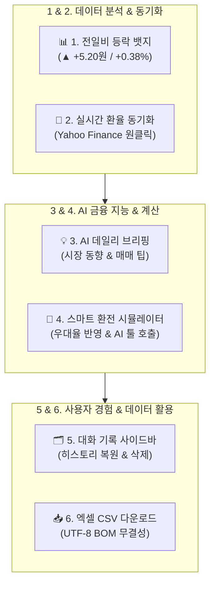
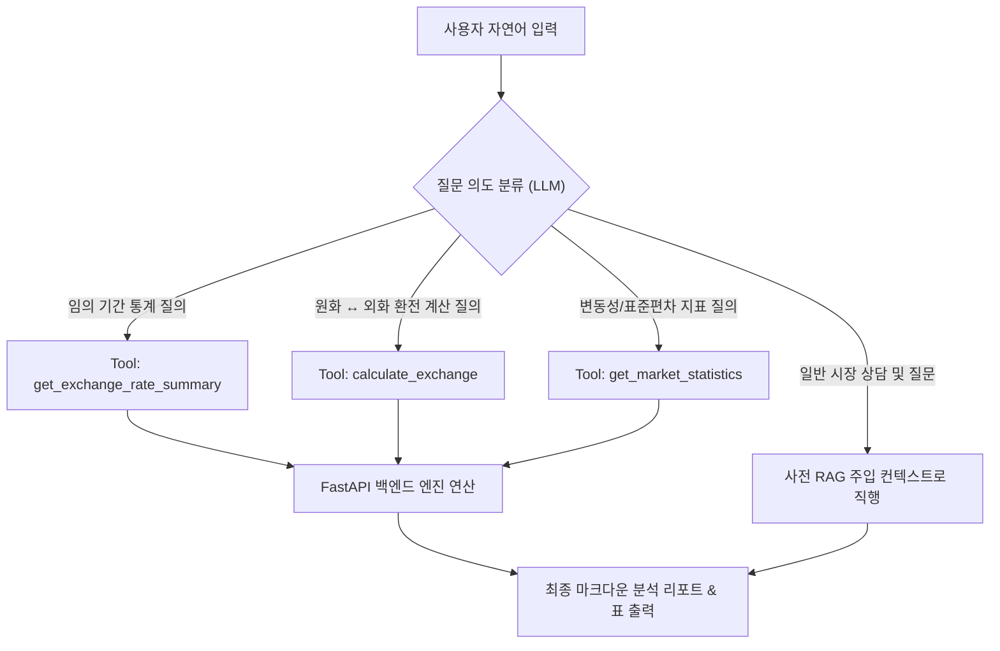
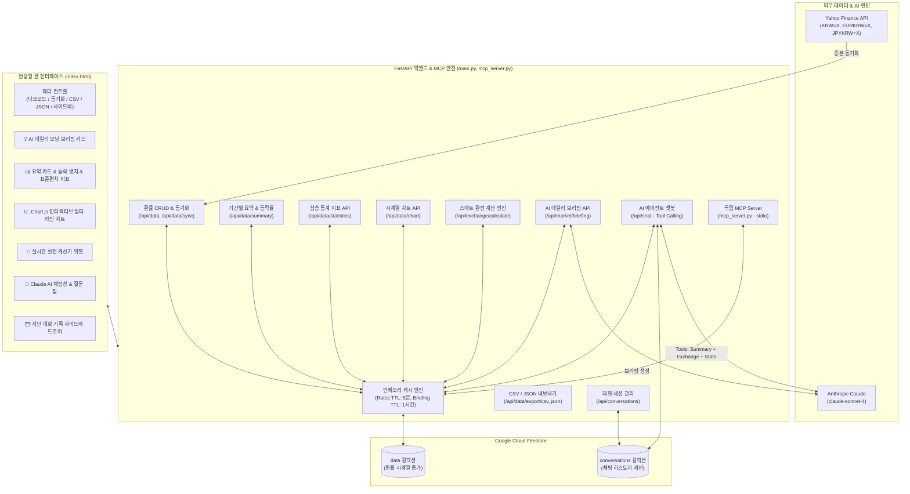

# 💱 외환(FX) 분석 AI 비서 (AI Agent FX)

> **Yahoo Finance 기반 외환 시계열 데이터 수집, 실시간 증분 동기화, Chart.js 인터랙티브 시각화, 스마트 환전 계산기, 지난 대화 기록 사이드바, CSV/JSON 엑셀 내보내기, MCP 서버 지원, 다크 모드, 그리고 Anthropic Claude 기반 자율 에이전트(Tool Use)를 결합한 올인원 금융 핀테크 AI 서비스**

---

## 📌 목차
1. [프로젝트 소개](#-프로젝트-소개)
2. [핵심 고도화 기능 6선](#-핵심-고도화-기능-6선)
3. [🎁 보너스 과제 구현 내역](#-보너스-과제-구현-내역)
   - [3.1 AI 도구 호출(Function Calling) & 멀티채널 연동 (MCP Server)](#31-ai-도구-호출function-calling--멀티채널-연동-mcp-server)
   - [3.2 인사이트·UX 고도화 (통계 확장, CSV/JSON, 다크 모드)](#32-인사이트ux-고도화-통계-확장-csvjson-다크-모드)
4. [전체 시스템 아키텍처 & 흐름도](#-전체-시스템-아키텍처--흐름도)
5. [기술 스택](#-기술-스택)
6. [프로젝트 구조](#-프로젝트-구조)
7. [API 엔드포인트 명세](#-api-엔드포인트-명세)
8. [설치 및 실행 가이드](#-설치-및-실행-가이드)
9. [환경 변수 설정 (.env)](#-환경-변수-설정-env)
10. [클라우드 배포 가이드 (Render)](#-클라우드-배포-가이드-render)

---

## 📖 프로젝트 소개

**환율 분석 AI 비서 (`ai_agent_fx`)**는 주요 3대 통화인 **미국 달러(USD), 유로(EUR), 일본 엔화(JPY)**의 환율 데이터를 실시간으로 동기화하고 시계열 분석을 수행하는 통합 핀테크 플랫폼입니다.

단순 환율 조회를 넘어, **전일 대비 실시간 등락 모멘텀 분석**, **Yahoo Finance 원클릭 동기화**, **Claude AI 외환 데일리 브리핑**, **은행 우대율 반영 스마트 환전 시뮬레이터**, **ChatGPT 스타일의 대화 기록 사이드바**, **엑셀 호환 CSV/JSON 데이터 내보내기**, **외부 AI 클라이언트를 위한 독립 MCP Server 지원**, 그리고 **세련된 다크 모드**까지 상용 금융 포털 수준의 풀스택 기능을 모두 제공합니다.

---

## 🚀 핵심 고도화 기능 6선



### 1. 📊 전일 대비 등락폭 & 변동률 뱃지 (실시간 모멘텀)
- 외환 시장의 핵심 지표인 **"어제보다 올랐는가, 내렸는가?"**를 통화 카드 상단에 직관적으로 제공
- 상승(`▲` 빨간색), 하락(`▼` 파란색), 보합(`-` 회색) 뱃지를 통해 전일 종가 대비 변동폭(원)과 변동률(%)을 한눈에 파악
- 기간별(7일, 30일, 90일, 전체) 평균, 최저, 최고 환율과 결합하여 종합적인 가격 밴드 제시

### 2. 🔄 실시간 최신 환율 증분 동기화 (`POST /api/data/sync`)
- 상단 **`[🔄 최신 환율 동기화]`** 원클릭으로 Yahoo Finance에서 최근 1개월 데이터를 즉시 스크래핑
- 기존 Firestore에 저장된 날짜와 비교하여 **중복 없는 증분(Incremental) 적재** 수행
- 동기화 완료 즉시 대시보드 통계 및 인터랙티브 차트가 자동으로 최신 데이터로 갱신

### 3. 💡 AI 오늘의 외환 시장 데일리 브리핑 (`GET /api/market/briefing`)
- Anthropic Claude가 최신 환율 및 7일간의 변동 추세를 종합 분석하여 매일 아침 금융 애널리스트 수준의 브리핑 제공
- 환전 타이밍, 통화별 강약세 요인 및 실전 투자 팁을 담은 요약 리포트 카드 상단 노출
- 백엔드 1시간 인메모리 캐싱(TTL)을 적용하여 AI 호출 비용 절감 및 초고속 로딩 보장

### 4. 🧮 스마트 실시간 환전 계산기 & AI Tool Calling 연동
- **웹 인터페이스 위젯**:
  - 금액 입력, 출발/도착 통화(`USD`, `EUR`, `JPY`, `KRW`) 자유 맞바꾸기(Swap)
  - 은행 수수료 우대율(`0%`, `50%`, `80%`, `90%`, `100%`) 선택 시 실질 수령액 및 절감액 실시간 산출
- **AI 챗봇 자율 도구 (`calculate_exchange`)**:
  - *"1,000달러를 원화로 환전하면 얼마야? 우대율 80%로 계산해줘"*, *"100만원으로 엔화 바꾸면 몇 엔이야?"* 등 자연어 질문 시 AI가 전용 계산 도구를 호출하여 정확한 환산 금액과 환전 팁을 마크다운 표로 안내

### 5. 🗂️ 지난 대화 목록 사이드바 (Sidebar Drawer UI)
- ChatGPT 스타일의 슬라이딩 사이드바 드로어 탑재 (`💬 대화 기록` 버튼)
- Firestore의 `conversations` 컬렉션과 완전 연동:
  - **대화 이력 조회**: 과거 나눈 상담 제목과 타임스탬프 목록 표시
  - **대화 복원**: 목록 클릭 시 과거 질의응답 내역을 채팅창에 그대로 복구하여 연속 상담 가능
  - **대화 삭제**: 휴지통(`🗑️`) 아이콘으로 불필요한 대화 영구 삭제
  - **새 대화**: `➕ 새 대화 시작하기` 버튼으로 깨끗한 세션 즉시 생성

### 6. 📥 환율 데이터 Excel / CSV 원클릭 다운로드 (`GET /api/data/export/csv`)
- 현재 선택된 기간(7일, 30일, 90일, 6개월 전체)의 일별 종가 시계열 데이터를 CSV 파일로 즉시 다운로드
- **UTF-8 with BOM (`\ufeff`)** 인코딩을 적용하여 엑셀(Microsoft Excel)에서 더블클릭으로 열어도 한글 깨짐 현상이 전혀 없음

---

## 🎁 보너스 과제 구현 내역

### 3.1 AI 도구 호출(Function Calling) & 멀티채널 연동 (MCP Server)

#### 1) 도구 호출 판단 근거 및 의사결정 매트릭스
AI 에이전트(Claude)는 사용자의 질문 유형과 의도를 분석하여 다음과 같은 엄격한 판단 근거에 따라 최적의 도구를 자율적으로 선택하여 호출합니다:

| 사용자 질문 유형 (질의 패턴) | 판단 근거 (Decision Reason) | 호출 도구 (Invoked Tool) | 반환 및 처리 결과 |
| :--- | :--- | :--- | :--- |
| *"최근 14일간 달러 평균 알려줘"*,<br>*"특정 기간 환율 통계 조회해줘"* | 사전에 주입된 기본 7일/30일/90일 컨텍스트에 없는 **임의 기간 또는 특정 날짜 범위** 조회 요구 | `get_exchange_rate_summary`<br>`(currency, days, start_date, end_date)` | 해당 기간의 평균, 최저, 최고, 전일비 등락, 표준편차를 Firestore 캐시에서 실시간 계산하여 전달 |
| *"1000달러 원화로 환전하면 얼마야?"*,<br>*"100만원으로 엔화 바꾸면 몇 엔?"* | 단순 시세 조회가 아닌 **외화 ↔ 원화 간의 실질 금액 환산 및 은행 우대 수수료 계산** 요구 | `calculate_exchange`<br>`(amount, from_curr, to_curr, preferential)` | 최신 매매기준율, 우대 스프레드가 반영된 수령액, 일반 대비 절감 금액 산출 결과 반환 |
| *"요즘 엔화 변동성이 어때?"*,<br>*"달러 표준편차나 가격 갭 분석해줘"* | 단순 평균을 넘어선 **변동성(Volatility), 변동계수(CV), 시장 안정도** 분석 요구 | `get_market_statistics`<br>`(days)` | 표준편차, High-Low 가격 갭, 변동계수, 7일 평균 괴리율 및 시장 안정도 등급 반환 |



---

#### 2) 외부 채널 연동: 독립 MCP Server (`mcp_server.py`) 구축
FastAPI 서버 외에도, Claude Desktop, Cursor 등 외부 MCP 클라이언트에서 본 외환 분석 기능을 독립적으로 직접 호출할 수 있는 **공식 Model Context Protocol 표준 서버(`mcp_server.py`)**를 구현하여 검증을 완료했습니다.

- **지원 도구 스펙**:
  - `get_rates_summary`: 기간별 환율 요약 및 표준편차 조회
  - `calculate_exchange`: 스마트 환전 금액 및 수수료 절감액 계산
  - `get_market_statistics`: 30일 변동성 및 시장 안정도 심층 지표
  - `get_market_briefing`: AI 데일리 모닝 브리핑
- **Claude Desktop / Cursor 연동 설정 (`claude_desktop_config.json`)**:
  ```json
  {
    "mcpServers": {
      "fx-analyst": {
        "command": "python",
        "args": [
          "d:/LEH/AI 네이티브/3. AI 응용학습/M1-2/ai_agent_fx/mcp_server.py"
        ]
      }
    }
  }
  ```
- **독립 검증 실행**:
  ```powershell
  python mcp_server.py --test
  # ✅ MCP Server Self-Test Success! 정상 검증 완료
  ```

---

### 3.2 인사이트·UX 고도화 (통계 확장, CSV/JSON, 다크 모드)

#### 1) 심층 통계 분석 지표 신설 (`GET /api/data/statistics`)
기존의 평균, 최저, 최고 외에 금융 투자 의사결정에 필수적인 **5대 추가 통계 지표**를 구현하였습니다:
- **표준편차 (Volatility)**: 기간 내 환율의 실질적인 가격 흔들림 강도 측정
- **가격 변동폭 (High-Low Gap)**: 기간 최고가와 최저가의 스프레드 갭
- **변동계수 (CV, Coefficient of Variation)**: 평균 대비 표준편차 비율(`%`)로 통화 간 상대적 변동성 비교
- **평균 대비 괴리율 (Disparity Ratio)**: 최신 환율이 기간 평균 대비 고평가/저평가된 정도(`+0.16%`)
- **시장 안정도 평가**: 변동계수 기반 '매우 안정', '보통', '변동성 높음' 자동 판정

#### 2) 프론트엔드 인터랙티브 시각화 & 듀얼 내보내기 (CSV + JSON)
- **Chart.js 멀티 라인 그래프**: USD, EUR, JPY의 시계열 추세를 부드러운 곡선 차트로 시각화하며, 범례 클릭을 통한 통화별 토글 지원
- **데이터 다운로드 듀얼 지원**:
  - **`[📥 CSV]` 다운로드**: 엑셀 한글 깨짐을 방지하는 `UTF-8 with BOM` 인코딩 지원
  - **`[📋 JSON]` 다운로드**: 개발자 및 외부 시스템 연동을 위한 RESTful 포맷 JSON 원클릭 다운로드

#### 3) 🌙 완벽한 다크 모드(Dark Mode) 지원
- 상단 헤더의 **`[🌓 테마 전환]`** 버튼을 통해 언제든지 다크/라이트 모드 전환 가능
- `localStorage`를 통해 사용자가 선택한 테마 설정을 브라우저에 영구 보존
- 차트 캔버스, 그리드선, 축 눈금 폰트, 통화 카드, 사이드바 드로어까지 완벽하게 다크 테마 팔레트로 실시간 동기화

---

## 🏗 전체 시스템 아키텍처 & 흐름도



---

## 💻 기술 스택

| 영역 | 기술 / 라이브러리 | 상세 내용 |
| :--- | :--- | :--- |
| **Backend** | `Python 3.13`, `FastAPI`, `Uvicorn` | 비동기 고성능 RESTful API 서버 구축 |
| **Data Validation** | `Pydantic v2` | 엄격한 데이터 스키마 및 직렬화(`model_dump`) |
| **Database** | `Google Cloud Firestore` | NoSQL 기반 환율 시계열 데이터 및 채팅 기록 영구 저장 |
| **AI / LLM** | `Anthropic Claude (claude-sonnet-4)` | 시스템 프롬프트 주입 및 멀티 Tool Calling 자율 루프 |
| **Protocol** | `Model Context Protocol (MCP)` | 외부 AI 클라이언트 연동용 JSON-RPC 2.0 서버 구현 |
| **Data Scraping** | `yfinance`, `pandas` | Yahoo Finance 실시간 종가 시계열 수집 및 증분 저장 |
| **Frontend** | `Vanilla HTML5 / CSS3 / ES6+` | 다크모드 및 반응형 지원 경량 웹 클라이언트 |
| **Visualization** | `Chart.js 4.x` | 인터랙티브 멀티 라인 시계열 환율 차트 |
| **Markdown** | `Marked.js` | AI 응답 마크다운 테이블 및 볼드체 웹 표준 렌더링 |
| **Deployment** | `Render` | 클라우드 웹 서비스 배포 환경 |

---

## 📁 프로젝트 구조

```plaintext
ai_agent_fx/
├── main.py                  # FastAPI 메인 애플리케이션 및 전체 API 엔드포인트
├── mcp_server.py            # 외부 채널 연동용 독립 Model Context Protocol (MCP) 서버
├── firebase_config.py       # Firebase Firestore 단일 인증 및 초기화 모듈
├── seed_data.py             # Yahoo Finance 기초 데이터 수집 및 Firestore 적재 스크립트
├── index.html               # 대시보드, 차트, 환전 계산기, 사이드바, 다크모드 통합 프론트엔드
├── requirements.txt         # 파이썬 의존성 패키지 목록
├── serviceAccountKey.json   # Firebase 서비스 계정 키 파일 (.gitignore 대상)
├── .env                     # API 키 및 환경 변수 설정 파일 (.gitignore 대상)
├── .gitignore               # Git 관리 제외 파일 설정
└── README.md                # 종합 프로젝트 안내 문서
```

---

## 📡 API 엔드포인트 명세

### 1. 환율 기본 및 동기화 API
- **`GET /api/data`**: 환율 원본 데이터 목록 조회 (`currency` 필터 지원)
- **`POST /api/data`**: 신규 환율 데이터 추가 (`201 Created`)
- **`PUT /api/data/{doc_id}`**: 특정 환율 데이터 수정
- **`DELETE /api/data/{doc_id}`**: 특정 환율 데이터 삭제
- **`POST /api/data/sync`**: Yahoo Finance 최신 환율 증분 동기화

### 2. 시계열 분석 & 시각화 & 내보내기 API
- **`GET /api/data/summary`**: 기간별 통계 + **전일 대비 등락폭/등락률** + **표준편차/변동폭** 반환
- **`GET /api/data/statistics`**: **[보너스 과제]** 표준편차, 변동계수, High-Low 갭, 괴리율 등 심층 지표
- **`GET /api/data/chart`**: Chart.js 렌더링용 USD, EUR, JPY 시계열 배열 반환
- **`GET /api/data/export/csv`**: 기간별 환율 데이터 엑셀 CSV (UTF-8 BOM) 다운로드
- **`GET /api/data/export/json`**: **[보너스 과제]** 기간별 환율 데이터 JSON 파일 다운로드

### 3. 스마트 금융 계산 & AI 브리핑 API
- **`GET /api/exchange/calculate`**: 최신 환율 및 은행 우대율 기반 정밀 환전 시뮬레이션
- **`GET /api/market/briefing`**: Claude AI 오늘의 외환 시장 데일리 모닝 브리핑 (1시간 캐시)

### 4. 대화 기록 & AI 에이전트 API
- **`GET /api/conversations`**: 저장된 전체 대화 목록 조회 (최신순 정렬)
- **`GET /api/conversations/{doc_id}`**: 특정 대화 메시지 전체 불러오기
- **`DELETE /api/conversations/{doc_id}`**: 특정 대화 세션 영구 삭제
- **`POST /api/chat`**: AI 에이전트 챗봇 (Dual Pipeline: 요약 RAG + Tool Calling)
  - 지원 도구: `get_exchange_rate_summary`, `calculate_exchange`, `get_market_statistics`

---

## 🚀 설치 및 실행 가이드

### 1. 가상환경 활성화 및 패키지 설치
```powershell
python -m venv venv
venv\Scripts\activate
pip install -r requirements.txt
```

### 2. 환경 변수 파일(`.env`) 설정
```env
ANTHROPIC_API_KEY=sk-cody-live-your-api-key
OPENAI_API_KEY=sk-cody-live-your-api-key
FIREBASE_SERVICE_ACCOUNT_JSON=serviceAccountKey.json
```

### 3. 기초 데이터 수집 (최초 1회 실행)
```powershell
python seed_data.py
```

### 4. 백엔드 서버 실행
```powershell
uvicorn main:app --reload --port 8000
```
- 서버 주소: `http://127.0.0.1:8000`
- 자동 API 문서 (Swagger): `http://127.0.0.1:8000/docs`

### 5. 독립 MCP Server 실행 및 검증 (보너스 과제)
```powershell
python mcp_server.py --test
```

### 6. 웹 프론트엔드 접속
브라우저에서 `index.html` 파일을 열거나 웹 서버로 접속합니다.
- 상단 **다크 모드(`🌙`)** 버튼 클릭으로 다크/라이트 테마를 자유롭게 전환할 수 있습니다.
- 상단 **`[📥 CSV]`** 및 **`[📋 JSON]`** 버튼으로 환율 데이터를 즉시 내보낼 수 있습니다.

---

## 🔑 환경 변수 설정 (.env)

| 변수명 | 필수 여부 | 설명 |
| :--- | :---: | :--- |
| `ANTHROPIC_API_KEY` | 필수 | Claude Sonnet 모델 호출용 Copa 프록시 또는 Anthropic API 키 |
| `FIREBASE_SERVICE_ACCOUNT_JSON` | 선택 | Firestore 인증용 JSON 키 파일 경로 (기본값: `serviceAccountKey.json`) |
| `FIREBASE_SERVICE_ACCOUNT_JSON_RAW` | 선택 | 클라우드 배포 시 파일 대신 JSON 문자열 자체를 환경변수로 주입할 때 사용 |

---

## ☁️ 클라우드 배포 가이드 (Render)

1. **GitHub 저장소 푸시**:
   ```powershell
   git add .
   git commit -m "feat: 보너스 과제 완료 - MCP 서버 연동, 심층 통계 API, 다크 모드, JSON 내보내기 구현"
   git push origin main
   ```
2. **Render Web Service 생성**:
   - **Build Command**: `pip install -r requirements.txt`
   - **Start Command**: `uvicorn main:app --host 0.0.0.0 --port $PORT`
   - **Environment Variables**:
     - `ANTHROPIC_API_KEY`: API 키
     - `FIREBASE_SERVICE_ACCOUNT_JSON_RAW`: `serviceAccountKey.json` 내용 문자열 주입
