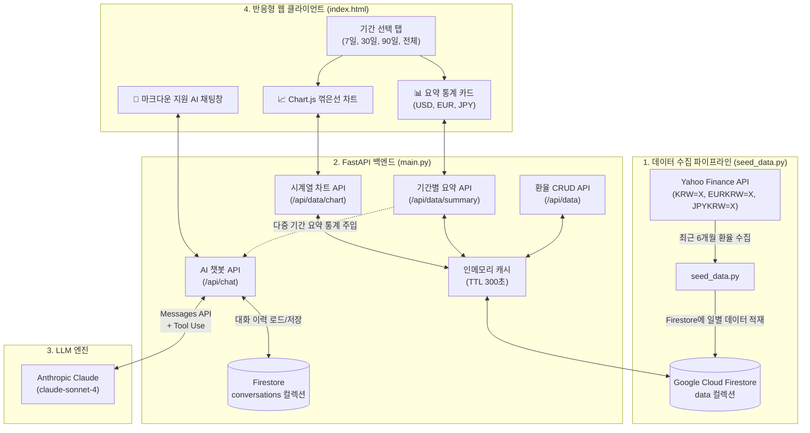
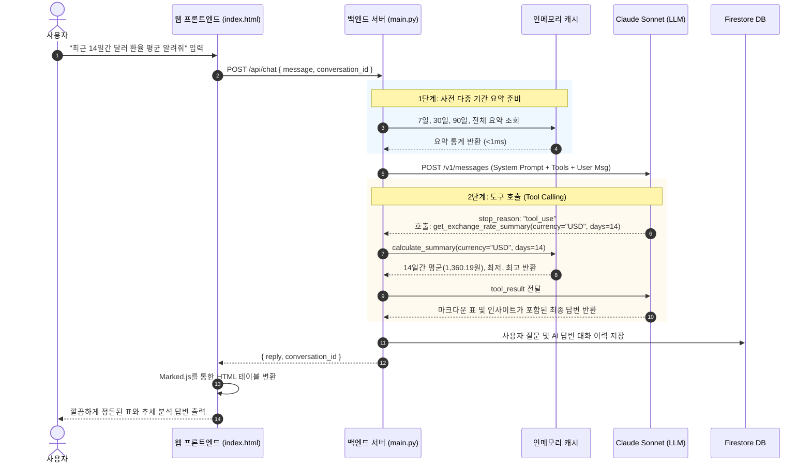

# 💱 외환(FX) 분석 AI 비서 (AI Agent FX)

> **Yahoo Finance 기반 외환 시계열 데이터 수집, 기간별 통계 분석, Chart.js 인터랙티브 시각화, 그리고 Anthropic Claude 기반 자율 에이전트(Tool Use)를 결합한 올인원 금융 AI 비서 서비스**

---

## 📌 목차
1. [프로젝트 소개](#-프로젝트-소개)
2. [주요 기능](#-주요-기능)
3. [전체 시스템 아키텍처 & 흐름도](#-전체-시스템-아키텍처--흐름도)
4. [기술 스택](#-기술-스택)
5. [프로젝트 구조](#-프로젝트-구조)
6. [API 엔드포인트 명세](#-api-엔드포인트-명세)
7. [설치 및 실행 가이드](#-설치-및-실행-가이드)
8. [환경 변수 설정 (.env)](#-환경-변수-설정-env)
9. [클라우드 배포 가이드 (Render)](#-클라우드-배포-가이드-render)

---

## 📖 프로젝트 소개

**환율 분석 AI 비서 (`ai_agent_fx`)**는 주요 3대 통화인 **미국 달러(USD), 유로(EUR), 일본 엔화(JPY)**의 최근 환율 데이터를 수집·가공하여 사용자가 원하는 기간(1주일, 1개월, 3개월, 6개월 등)의 평균, 최저, 최고 환율을 직관적으로 확인하고 시계열 차트로 시각화할 수 있도록 지원합니다.

특히 **LLM(Anthropic Claude)**과 연동된 AI 비서는 질문 의도를 파악하여 적절한 통계 데이터를 스스로 조회(Tool Calling)하거나 사전 주입된 컨텍스트를 활용해 실시간으로 외환 전문가 수준의 시장 분석과 인사이트를 제공합니다.

---

## ✨ 주요 기능

### 1. 📊 유연한 기간별 환율 요약 통계
- **기간 탭 원클릭 조회**: `전체(6개월)`, `최근 1주일(7일)`, `최근 1개월(30일)`, `최근 3개월(90일)`
- **정확한 적용 기간 표시**: 모든 통화 카드와 상단 배너에 실제 계산에 반영된 날짜 구간(예: `2026-08-24 ~ 2026-09-23`)을 명시하여 데이터 신뢰성 확보
- **정돈된 통화 카드**: 달러(USD) → 유로(EUR) → 엔화(JPY) 순으로 정렬되며, 엔화의 100엔당 단위 표기를 단일 행으로 정돈

### 2. 📈 Chart.js 기반 인터랙티브 시각화
- 기간 선택에 따라 부드러운 애니메이션과 함께 USD, EUR, JPY의 환율 변동 추이를 꺾은선 그래프로 제공
- 상단 범례(Legend) 클릭을 통해 원하는 통화의 선 그래프만 선택적으로 On/Off 토글 가능
- 마우스 호버 시 정확한 날짜 및 일별 종가 환율 툴팁 표시
- 클라우드 실서버 및 로컬 서버 모두 호환되는 이중 렌더링 폴백 엔진 탑재

### 3. 🤖 외환 전문 AI 에이전트 챗봇
- **Dual Pipeline (사전 컨텍스트 주입 + 자율 Tool Calling)**:
  - 자주 묻는 주요 기간(7일, 30일, 90일, 전체)의 통계는 시스템 프롬프트에 미리 주입하여 지연 시간 없이 초고속 답변
  - 사용자가 "최근 14일 달러 평균은?", "특정 월 환율은?" 등 사전에 없는 임의 기간을 질의하면 Claude가 스스로 `get_exchange_rate_summary` 도구를 호출하여 Firestore DB에서 실시간 계산 후 답변
- **마크다운 표(Table) 완벽 렌더링**: AI 답변 내의 표 서식을 브라우저가 인식하여 깨짐 없는 깔끔한 웹 표준 HTML 테이블로 출력
- **대화 세션 영속성 & 슬라이딩 윈도우**: 대화 이력을 Firestore에 세션별로 저장하며, 최근 10개 대화만 전달하여 토큰 한도 초과 방지

### 4. ⚡ Firestore 인메모리 캐싱 (TTL 5분)
- 요약 통계 및 차트 조회가 빈번히 일어나도 매번 Firestore 전체 문서를 재스캔하지 않고 메모리 캐시를 활용
- **Firestore Read 비용 99% 절감** 및 API 응답 속도 **1ms 미만** 달성
- CRUD(추가/수정/삭제) 발생 시 즉시 캐시를 무효화(Invalidate)하여 데이터 정합성 유지

### 5. 🛡️ 일원화된 Firebase 인증 (`firebase_config.py`)
- 로컬 키 파일(`serviceAccountKey.json`), 파일 경로 환경변수(`FIREBASE_SERVICE_ACCOUNT_JSON`), 클라우드 Raw JSON 문자열(`FIREBASE_SERVICE_ACCOUNT_JSON_RAW`), ADC(Application Default Credentials)를 모두 지원하여 Render 등 클라우드 배포 시 물리적 키 파일 없이 환경변수만으로 배포 가능

---

## 🏗 전체 시스템 아키텍처 & 흐름도

### 1) 시스템 전체 아키텍처



### 2) AI 에이전트 질의 처리 흐름 (Sequence Diagram)



---

## 💻 기술 스택

| 영역 | 기술 / 라이브러리 | 상세 내용 |
| :--- | :--- | :--- |
| **Backend** | `Python 3.13`, `FastAPI`, `Uvicorn` | 고성능 비동기 RESTful API 서버 구축 |
| **Data Validation** | `Pydantic v2` | 엄격한 데이터 스키마 및 직렬화(`model_dump`) |
| **Database** | `Google Cloud Firestore` | NoSQL 기반 환율 시계열 데이터 및 채팅 기록 영구 저장 |
| **AI / LLM** | `Anthropic Claude (claude-sonnet-4)` | 시스템 프롬프트 RAG 주입 및 도구 호출(Tool Use) 에이전트 루프 |
| **Data Scraping** | `yfinance`, `pandas` | Yahoo Finance에서 외환 종가 시계열 수집 |
| **Frontend** | `Vanilla HTML5 / CSS3 / ES6+` | 빌드 없이 동작하는 경량 반응형 대시보드 |
| **Visualization** | `Chart.js 4.x` | 인터랙티브 멀티 라인 시계열 환율 차트 |
| **Markdown** | `Marked.js` | AI 응답 마크다운 테이블 및 볼드체 웹 표준 렌더링 |
| **Deployment** | `Render` | 클라우드 웹 서비스 배포 환경 |

---

## 📁 프로젝트 구조

```plaintext
ai_agent_fx/
├── main.py                  # FastAPI 메인 애플리케이션 및 API 엔드포인트
├── firebase_config.py       # Firebase Firestore 단일 인증 및 초기화 모듈
├── seed_data.py             # Yahoo Finance 환율 데이터 수집 및 Firestore 적재 스크립트
├── index.html               # 대시보드, Chart.js 시각화 및 AI 챗봇 통합 웹 인터페이스
├── requirements.txt         # 파이썬 의존성 패키지 목록
├── serviceAccountKey.json   # Firebase 서비스 계정 키 파일 (.gitignore 대상)
├── .env                     # API 키 및 환경 변수 설정 파일 (.gitignore 대상)
├── .gitignore               # Git 관리 제외 파일 설정
└── README.md                # 프로젝트 안내 문서
```

---

## 📡 API 엔드포인트 명세

### 1. 환율 데이터 CRUD (`/api/data`)
- **`GET /api/data`**: 전체 환율 데이터 조회
  - Query Params: `currency` (선택: `USD`, `EUR`, `JPY`)
- **`POST /api/data`**: 신규 환율 데이터 추가 (`201 Created`)
- **`PUT /api/data/{doc_id}`**: 특정 환율 데이터 수정
- **`DELETE /api/data/{doc_id}`**: 특정 환율 데이터 삭제

### 2. 기간별 환율 요약 (`/api/data/summary`)
- **`GET /api/data/summary`**
  - Query Params:
    - `period`: 약어 기간 (`1w`, `1m`, `3m`, `6m`, `all`)
    - `days`: 최근 N일 (`7`, `30`, `90` 등)
    - `currency`: 특정 통화 (`USD`, `EUR`, `JPY`)
    - `start_date`, `end_date`: 특정 날짜 범위 (`YYYY-MM-DD`)
  - **응답 예시**:
    ```json
    {
      "period": {
        "days": 30,
        "start_date": "2026-08-24",
        "end_date": "2026-09-23",
        "description": "2026-08-24 ~ 2026-09-23 (최근 30일)"
      },
      "summary": {
        "USD": { "데이터 개수": "23개", "평균 환율": 1364.88, "최저 환율": 1339.17, "최고 환율": 1384.98 },
        "EUR": { "데이터 개수": "23개", "평균 환율": 1579.93, "최저 환율": 1555.19, "최고 환율": 1616.97 },
        "JPY": { "데이터 개수": "23개", "평균 환율": 869.51, "최저 환율": 854.7, "최고 환율": 883.53 }
      }
    }
    ```

### 3. 인터랙티브 차트 시계열 데이터 (`/api/data/chart`)
- **`GET /api/data/chart`**: Chart.js 렌더링에 최적화된 날짜별 USD, EUR, JPY 시계열 배열 반환
  - Query Params: `period`, `days`, `start_date`, `end_date`

### 4. AI 챗봇 (`/api/chat`)
- **`POST /api/chat`**
  - Request Body: `{"message": "최근 한달간의 엔화 환율 평균 알려줘", "conversation_id": "선택사항"}`
  - Response: `{"reply": "답변 마크다운 텍스트", "conversation_id": "대화 ID"}`

### 5. 대화 세션 관리 (`/api/conversations`)
- **`GET /api/conversations`**: 저장된 대화 목록 조회 (최신순)
- **`GET /api/conversations/{doc_id}`**: 특정 대화 상세 내역 조회
- **`DELETE /api/conversations/{doc_id}`**: 특정 대화 삭제

---

## 🚀 설치 및 실행 가이드

### 1. 저장소 클론 및 가상환경 설정
```powershell
# 1) 가상환경 생성 및 활성화
python -m venv venv
venv\Scripts\activate

# 2) 필수 패키지 설치
pip install -r requirements.txt
```

### 2. 환경 변수 파일(`.env`) 생성
프로젝트 루트 경로에 `.env` 파일을 생성하고 아래 항목을 입력합니다:
```env
ANTHROPIC_API_KEY=sk-cody-live-your-api-key
OPENAI_API_KEY=sk-cody-live-your-api-key
FIREBASE_SERVICE_ACCOUNT_JSON=serviceAccountKey.json
```

### 3. 기초 환율 데이터 수집 (최초 1회 실행)
```powershell
python seed_data.py
```
> Yahoo Finance에서 최근 6개월간의 환율 데이터를 다운로드하여 Firestore의 `data` 컬렉션에 자동 저장합니다.

### 4. 백엔드 서버 실행
```powershell
uvicorn main:app --reload --port 8000
```
- 서버 접속 주소: `http://127.0.0.1:8000`
- API 자동 Swagger 문서: `http://127.0.0.1:8000/docs`

### 5. 웹 프론트엔드 실행
브라우저에서 `index.html` 파일을 직접 더블 클릭하여 열거나 로컬 웹 서버로 접속합니다.
- 상단 **API 서버** 셀렉터에서 `로컬 서버 (127.0.0.1:8000)` 또는 `클라우드 (Render 실서버)`를 선택하여 자유롭게 테스트할 수 있습니다.

---

## 🔑 환경 변수 설정 (.env)

| 변수명 | 필수 여부 | 설명 |
| :--- | :---: | :--- |
| `ANTHROPIC_API_KEY` | 필수 | Claude Sonnet 모델 호출용 Copa 프록시 또는 Anthropic API 키 |
| `FIREBASE_SERVICE_ACCOUNT_JSON` | 선택 | Firestore 인증용 JSON 키 파일 경로 (기본값: `serviceAccountKey.json`) |
| `FIREBASE_SERVICE_ACCOUNT_JSON_RAW` | 선택 | 클라우드 배포 시 파일 대신 JSON 문자열 자체를 환경변수로 주입할 때 사용 |

---

## ☁️ 클라우드 배포 가이드 (Render)

1. GitHub 저장소에 최신 코드를 푸시합니다:
   ```powershell
   git add .
   git commit -m "feat: 환율 비서 풀스택 고도화 및 차트 시각화 구현"
   git push origin main
   ```
2. **Render Dashboard**에서 Web Service 생성:
   - **Build Command**: `pip install -r requirements.txt`
   - **Start Command**: `uvicorn main:app --host 0.0.0.0 --port $PORT`
   - **Environment Variables**:
     - `ANTHROPIC_API_KEY`: 발급받은 API 키
     - `FIREBASE_SERVICE_ACCOUNT_JSON_RAW`: `serviceAccountKey.json` 파일의 내용을 한 줄 문자열로 입력 (Secret File 대신 사용 가능하여 매우 편리함)
3. 배포가 완료되면 프론트엔드 `index.html`의 `API_BASE_URL` 또는 헤더 드롭다운을 통해 실서버와 즉시 통신할 수 있습니다.
