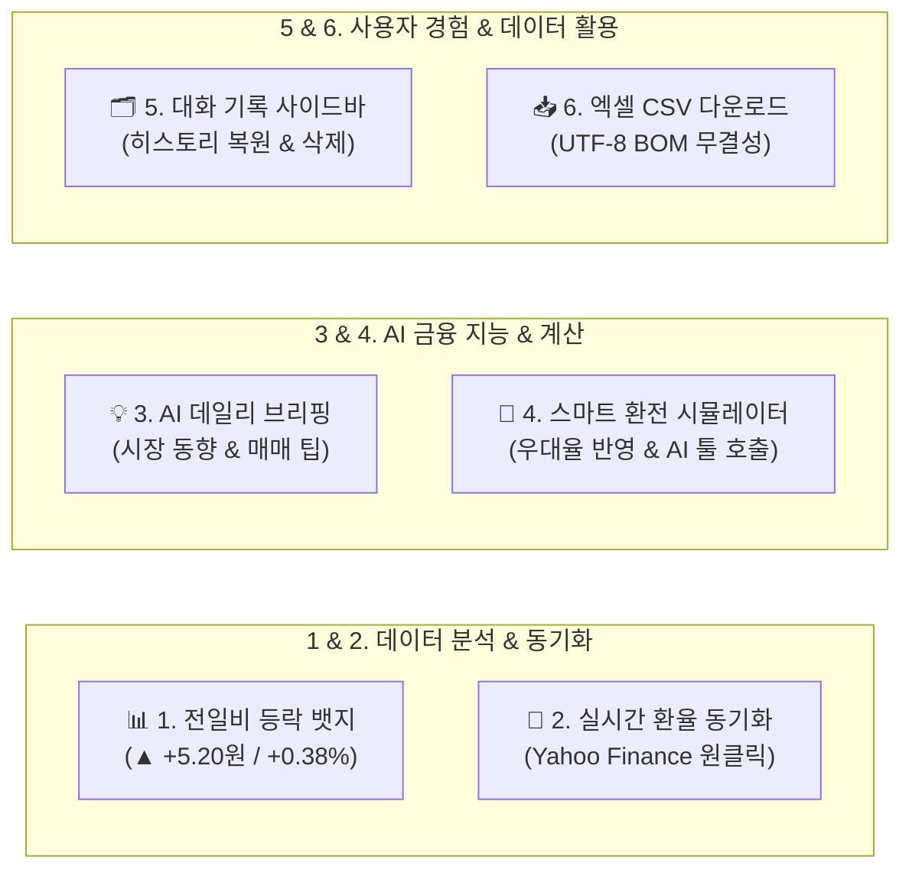
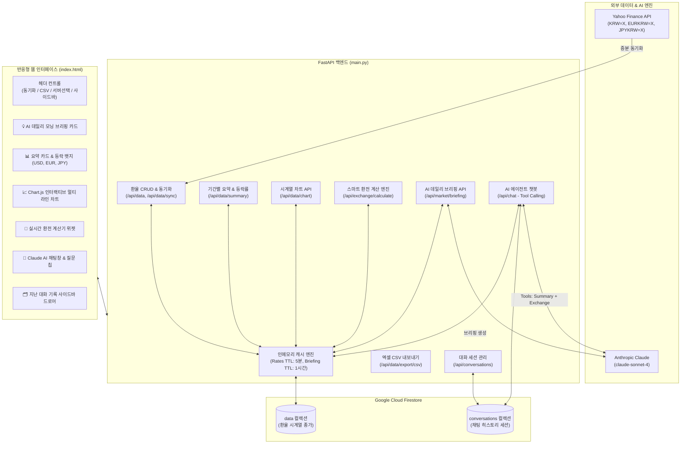
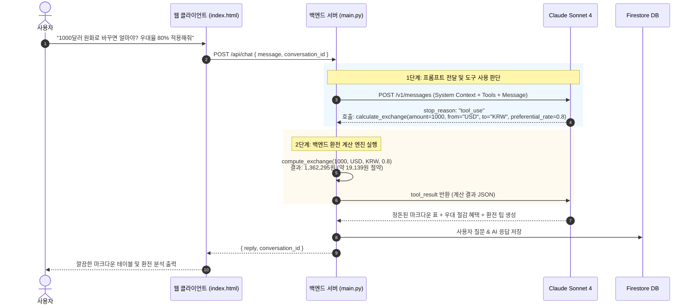

# 💱 외환(FX) 분석 AI 비서 (AI Agent FX)

> **Yahoo Finance 기반 외환 시계열 데이터 수집, 실시간 증분 동기화, Chart.js 인터랙티브 시각화, 스마트 환전 계산기, 지난 대화 기록 사이드바, CSV 엑셀 내보내기, 그리고 Anthropic Claude 기반 자율 에이전트(Tool Use)를 결합한 올인원 금융 핀테크 AI 서비스**

---

## 📌 목차
1. [프로젝트 소개](#-프로젝트-소개)
2. [핵심 고도화 기능 6선](#-핵심-고도화-기능-6선)
3. [전체 시스템 아키텍처 & 흐름도](#-전체-시스템-아키텍처--흐름도)
4. [기술 스택](#-기술-스택)
5. [프로젝트 구조](#-프로젝트-구조)
6. [API 엔드포인트 명세](#-api-엔드포인트-명세)
7. [설치 및 실행 가이드](#-설치-및-실행-가이드)
8. [환경 변수 설정 (.env)](#-환경-변수-설정-env)
9. [클라우드 배포 가이드 (Render)](#-클라우드-배포-가이드-render)

---

## 📖 프로젝트 소개

**환율 분석 AI 비서 (`ai_agent_fx`)**는 주요 3대 통화인 **미국 달러(USD), 유로(EUR), 일본 엔화(JPY)**의 환율 데이터를 실시간으로 동기화하고 시계열 분석을 수행하는 통합 핀테크 플랫폼입니다.

단순 환율 조회를 넘어, **전일 대비 실시간 등락 모멘텀 분석**, **Yahoo Finance 원클릭 동기화**, **Claude AI 외환 데일리 브리핑**, **은행 우대율 반영 스마트 환전 시뮬레이터**, **ChatGPT 스타일의 대화 기록 사이드바**, **엑셀 호환 CSV 데이터 내보내기**까지 상용 금융 포털 수준의 풀스택 기능을 모두 제공합니다.

---

## 🚀 핵심 고도화 기능 6선



### 1. 📊 전일 대비 등락폭 & 변동률 뱃지 (실시간 모멘텀)
- 외환 시장의 핵심 지표인 **"어제보다 올랐는가, 내렸는가?"**를 통화 카드 상단에 직관적으로 제공
- 상승(`▲` 빨간색), 하락(`▼` 파란색), 보합(`-` 회색) 뱃지를 통해 전일 종가 대비 변동폭(원)과 변동률(%)을 한눈에 파악
- 기간별(7일, 30일, 90일, 전체) 평균, 최저, 최고 환율과 결합하여 종합적인 가격 밴드 제시

### 2. 🔄 실시간 최신 환율 증분 동기화 (`POST /api/data/sync`)
- 상단 **`[🔄 최신 환율 동기화]`** 원클릭으로 Yahoo Finance에서 최근 1개월 데이터를 즉시 스크래핑
- 기존 Firestore에 저장된 날짜와 비교하여 **중복 없는 증분(Incremental) 적재** 수행
- 동기화 완료 즉시 대시보드 통계 및 인터랙티브 차트가 자동으로 최신 데이터로 갱신

### 3. 💡 AI 오늘의 외환 시장 데일리 브리핑 (`GET /api/market/briefing`)
- Anthropic Claude가 최신 환율 및 7일간의 변동 추세를 종합 분석하여 매일 아침 금융 애널리스트 수준의 브리핑 제공
- 환전 타이밍, 통화별 강약세 요인 및 실전 투자 팁을 담은 요약 리포트 카드 상단 노출
- 백엔드 1시간 인메모리 캐싱(TTL)을 적용하여 AI 호출 비용 절감 및 초고속 로딩 보장

### 4. 🧮 스마트 실시간 환전 계산기 & AI Tool Calling 연동
- **웹 인터페이스 위젯**:
  - 금액 입력, 출발/도착 통화(`USD`, `EUR`, `JPY`, `KRW`) 자유 맞바꾸기(Swap)
  - 은행 수수료 우대율(`0%`, `50%`, `80%`, `90%`, `100%`) 선택 시 실질 수령액 및 절감액 실시간 산출
- **AI 챗봇 자율 도구 (`calculate_exchange`)**:
  - *"1,000달러를 원화로 환전하면 얼마야? 우대율 80%로 계산해줘"*, *"100만원으로 엔화 바꾸면 몇 엔이야?"* 등 자연어 질문 시 AI가 전용 계산 도구를 호출하여 정확한 환산 금액과 환전 팁을 마크다운 표로 안내

### 5. 🗂️ 지난 대화 목록 사이드바 (Sidebar Drawer UI)
- ChatGPT 스타일의 슬라이딩 사이드바 드로어 탑재 (`💬 대화 기록` 버튼)
- Firestore의 `conversations` 컬렉션과 완전 연동:
  - **대화 이력 조회**: 과거 나눈 상담 제목과 타임스탬프 목록 표시
  - **대화 복원**: 목록 클릭 시 과거 질의응답 내역을 채팅창에 그대로 복구하여 연속 상담 가능
  - **대화 삭제**: 휴지통(`🗑️`) 아이콘으로 불필요한 대화 영구 삭제
  - **새 대화**: `➕ 새 대화 시작하기` 버튼으로 깨끗한 세션 즉시 생성

### 6. 📥 환율 데이터 Excel / CSV 원클릭 다운로드 (`GET /api/data/export/csv`)
- 현재 선택된 기간(7일, 30일, 90일, 6개월 전체)의 일별 종가 시계열 데이터를 CSV 파일로 즉시 다운로드
- **UTF-8 with BOM (`\ufeff`)** 인코딩을 적용하여 엑셀(Microsoft Excel)에서 더블클릭으로 열어도 한글 깨짐 현상이 전혀 없음

---

## 🏗 전체 시스템 아키텍처 & 흐름도

### 1) 시스템 전체 아키텍처



### 2) AI 에이전트 자율 Tool Calling 처리 흐름



---

## 💻 기술 스택

| 영역 | 기술 / 라이브러리 | 상세 내용 |
| :--- | :--- | :--- |
| **Backend** | `Python 3.13`, `FastAPI`, `Uvicorn` | 고성능 비동기 RESTful API 서버 구축 |
| **Data Validation** | `Pydantic v2` | 엄격한 데이터 스키마 및 직렬화(`model_dump`) |
| **Database** | `Google Cloud Firestore` | NoSQL 기반 환율 시계열 데이터 및 채팅 기록 영구 저장 |
| **AI / LLM** | `Anthropic Claude (claude-sonnet-4)` | 시스템 프롬프트 주입 및 멀티 Tool Calling 자율 루프 |
| **Data Scraping** | `yfinance`, `pandas` | Yahoo Finance 실시간 종가 시계열 수집 및 증분 저장 |
| **Frontend** | `Vanilla HTML5 / CSS3 / ES6+` | 빌드 도구 없이 동작하는 반응형 인터페이스 |
| **Visualization** | `Chart.js 4.x` | 인터랙티브 멀티 라인 시계열 환율 차트 |
| **Markdown** | `Marked.js` | AI 응답 마크다운 테이블 및 볼드체 웹 표준 렌더링 |
| **Deployment** | `Render` | 클라우드 웹 서비스 배포 환경 |

---

## 📁 프로젝트 구조

```plaintext
ai_agent_fx/
├── main.py                  # FastAPI 메인 애플리케이션 및 전체 API 엔드포인트
├── firebase_config.py       # Firebase Firestore 단일 인증 및 초기화 모듈
├── seed_data.py             # Yahoo Finance 기초 데이터 수집 및 Firestore 적재 스크립트
├── index.html               # 대시보드, 차트, 환전 계산기, 사이드바, AI 챗봇 통합 프론트엔드
├── requirements.txt         # 파이썬 의존성 패키지 목록
├── serviceAccountKey.json   # Firebase 서비스 계정 키 파일 (.gitignore 대상)
├── .env                     # API 키 및 환경 변수 설정 파일 (.gitignore 대상)
├── .gitignore               # Git 관리 제외 파일 설정
└── README.md                # 종합 프로젝트 안내 문서
```

---

## 📡 API 엔드포인트 명세

### 1. 환율 기본 및 동기화 API
- **`GET /api/data`**: 환율 원본 데이터 목록 조회 (`currency` 필터 지원)
- **`POST /api/data`**: 신규 환율 데이터 추가 (`201 Created`)
- **`PUT /api/data/{doc_id}`**: 특정 환율 데이터 수정
- **`DELETE /api/data/{doc_id}`**: 특정 환율 데이터 삭제
- **`POST /api/data/sync`**: **[신규]** Yahoo Finance 최신 환율 증분 동기화

### 2. 시계열 분석 & 시각화 API
- **`GET /api/data/summary`**: 기간별(7일, 30일, 90일, 전체) 통계 + **전일 대비 등락폭/등락률** 반환
- **`GET /api/data/chart`**: Chart.js 렌더링용 USD, EUR, JPY 시계열 배열 반환
- **`GET /api/data/export/csv`**: **[신규]** 선택 기간 환율 데이터 CSV (UTF-8 BOM) 다운로드

### 3. 스마트 금융 계산 & AI 브리핑 API
- **`GET /api/exchange/calculate`**: **[신규]** 최신 환율 및 은행 우대율 기반 정밀 환전 시뮬레이션
  - Params: `amount`, `from_currency`, `to_currency`, `preferential_rate`
- **`GET /api/market/briefing`**: **[신규]** Claude AI 오늘의 외환 시장 데일리 모닝 브리핑 (1시간 캐시)

### 4. 대화 기록 & AI 에이전트 API
- **`GET /api/conversations`**: 저장된 전체 대화 목록 조회 (최신순 정렬)
- **`GET /api/conversations/{doc_id}`**: 특정 대화 메시지 전체 불러오기
- **`DELETE /api/conversations/{doc_id}`**: 특정 대화 세션 영구 삭제
- **`POST /api/chat`**: AI 에이전트 챗봇 (Dual Pipeline: 요약 RAG + Tool Calling)
  - 지원 도구: `get_exchange_rate_summary`, `calculate_exchange`

---

## 🚀 설치 및 실행 가이드

### 1. 저장소 클론 및 가상환경 활성화
```powershell
# 1) 가상환경 생성 및 활성화
python -m venv venv
venv\Scripts\activate

# 2) 필수 패키지 설치
pip install -r requirements.txt
```

### 2. 환경 변수 파일(`.env`) 설정
프로젝트 루트 경로에 `.env` 파일을 생성하고 아래 항목을 입력합니다:
```env
ANTHROPIC_API_KEY=sk-cody-live-your-api-key
OPENAI_API_KEY=sk-cody-live-your-api-key
FIREBASE_SERVICE_ACCOUNT_JSON=serviceAccountKey.json
```

### 3. 기초 데이터 수집 (최초 1회 실행)
```powershell
python seed_data.py
```
> Yahoo Finance에서 최근 6개월간의 환율 데이터를 다운로드하여 Firestore의 `data` 컬렉션에 자동 저장합니다.

### 4. 백엔드 서버 실행
```powershell
uvicorn main:app --reload --port 8000
```
- 서버 접속 주소: `http://127.0.0.1:8000`
- API 자동 Swagger 문서: `http://127.0.0.1:8000/docs`

### 5. 웹 프론트엔드 접속
브라우저에서 `index.html` 파일을 열거나 로컬 웹 서버로 접속합니다.
- 상단 **API 서버** 셀렉터에서 `로컬 서버 (127.0.0.1:8000)` 또는 `클라우드 (Render 실서버)`를 선택하여 즉시 테스트할 수 있습니다.

---

## 🔑 환경 변수 설정 (.env)

| 변수명 | 필수 여부 | 설명 |
| :--- | :---: | :--- |
| `ANTHROPIC_API_KEY` | 필수 | Claude Sonnet 모델 호출용 Copa 프록시 또는 Anthropic API 키 |
| `FIREBASE_SERVICE_ACCOUNT_JSON` | 선택 | Firestore 인증용 JSON 키 파일 경로 (기본값: `serviceAccountKey.json`) |
| `FIREBASE_SERVICE_ACCOUNT_JSON_RAW` | 선택 | 클라우드 배포 시 파일 대신 JSON 문자열 자체를 환경변수로 주입할 때 사용 |

---

## ☁️ 클라우드 배포 가이드 (Render)

1. **GitHub 저장소 푸시**:
   ```powershell
   git add .
   git commit -m "feat: 환율 전일비 등락, 실시간 동기화, AI 브리핑, 환전 계산기, 사이드바, CSV 다운로드 구현"
   git push origin main
   ```
2. **Render Web Service 생성**:
   - **Build Command**: `pip install -r requirements.txt`
   - **Start Command**: `uvicorn main:app --host 0.0.0.0 --port $PORT`
   - **Environment Variables**:
     - `ANTHROPIC_API_KEY`: API 키
     - `FIREBASE_SERVICE_ACCOUNT_JSON_RAW`: `serviceAccountKey.json` 내용 문자열 주입
